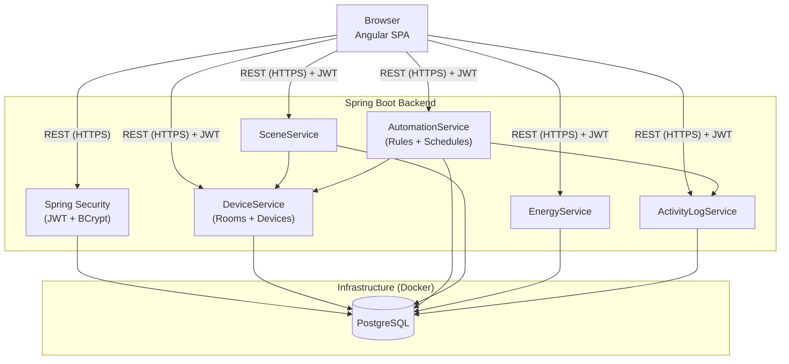
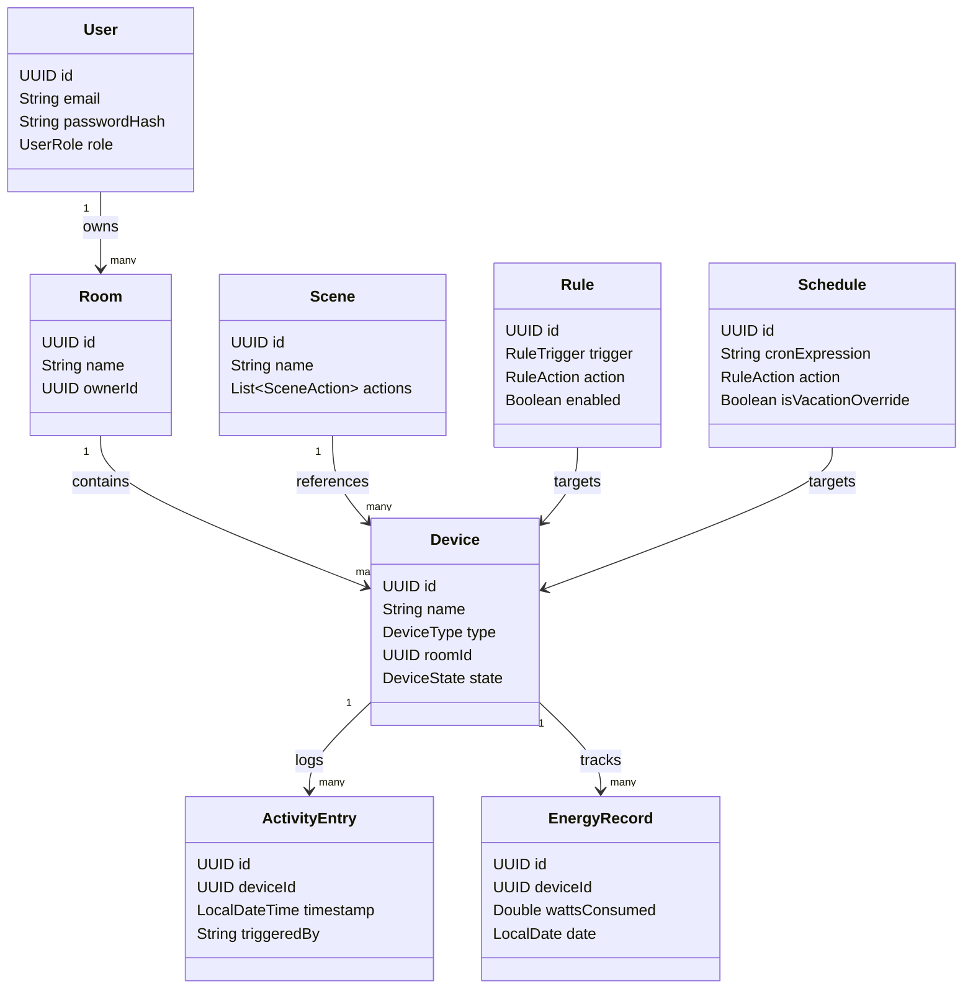

# Architecture UML

## System Overview

**Key design decisions:**
- **Authentication** is handled by Spring Security with BCrypt password hashing and self-issued JWTs — satisfies NFR-02
- **PostgreSQL** runs in a Docker container, configured via `docker-compose.yml` committed to the repository — all developers share the same DB setup
- **Real-time device state updates** are pushed via WebSocket (STOMP) from the backend — no external infrastructure needed
- **MQTT / IoT** is out of scope (virtual devices only); FR-18 is an optional extension

---

## Class Diagram

**Notes:**
- `passwordHash` is managed by Spring Security (BCrypt) — plain-text passwords are never stored or logged (NFR-02)
- `UserRole` (Owner / Member) is enforced by Spring Security method-level authorization
- DB schema is managed via Flyway migrations — version-controlled and shared across all developers
