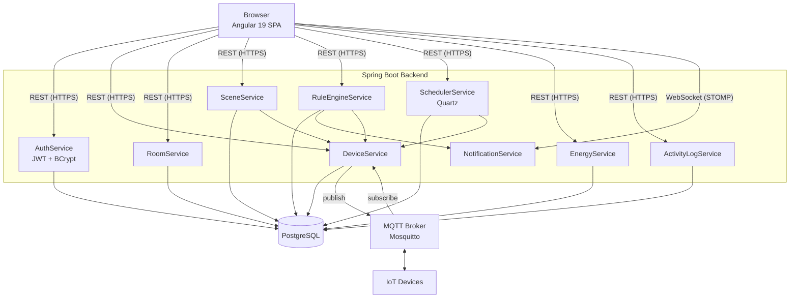
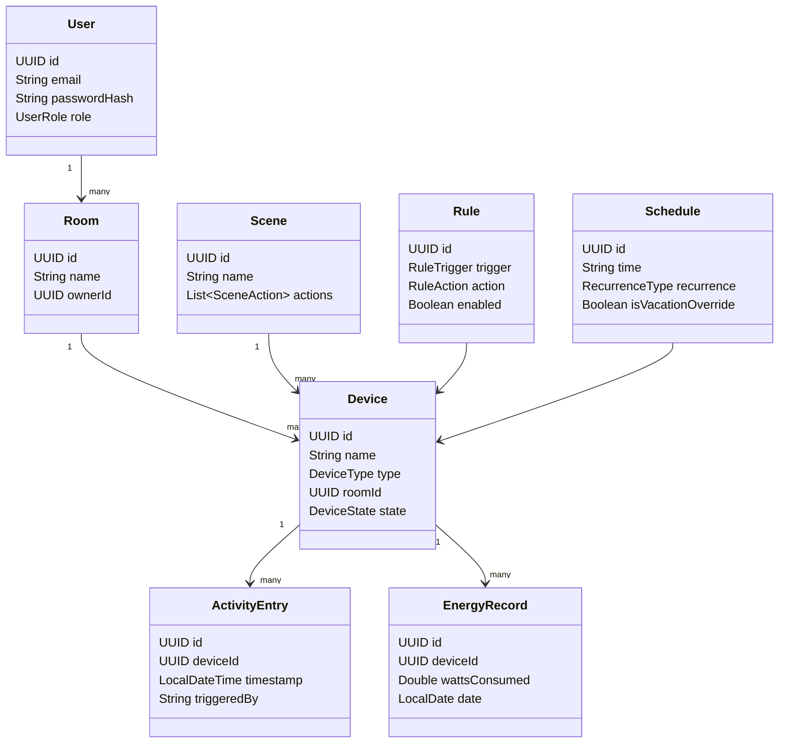

# Architecture UML

```mermaid
graph TD
    Browser["Browser\nAngular 19 SPA"]

    subgraph Backend["Spring Boot Backend"]
        Auth["AuthService\nJWT + BCrypt"]
        DevSvc["DeviceService"]
        RoomSvc["RoomService"]
        SceneSvc["SceneService"]
        RuleEng["RuleEngineService"]
        SchedSvc["SchedulerService\nQuartz"]
        EnergySvc["EnergyService"]
        LogSvc["ActivityLogService"]
        NotifSvc["NotificationService"]
    end

    DB[("PostgreSQL")]
    MQTT["MQTT Broker\nMosquitto"]
    IoT["IoT Devices"]

    Browser -- "REST (HTTPS)" --> Auth
    Browser -- "REST (HTTPS)" --> DevSvc
    Browser -- "REST (HTTPS)" --> RoomSvc
    Browser -- "REST (HTTPS)" --> SceneSvc
    Browser -- "REST (HTTPS)" --> RuleEng
    Browser -- "REST (HTTPS)" --> SchedSvc
    Browser -- "REST (HTTPS)" --> EnergySvc
    Browser -- "REST (HTTPS)" --> LogSvc
    Browser -- "WebSocket (STOMP)" --> NotifSvc

    Auth --> DB
    DevSvc --> DB
    RoomSvc --> DB
    SceneSvc --> DB
    RuleEng --> DB
    SchedSvc --> DB
    EnergySvc --> DB
    LogSvc --> DB

    RuleEng --> NotifSvc
    RuleEng --> DevSvc
    SceneSvc --> DevSvc
    SchedSvc --> DevSvc

    DevSvc -- "publish" --> MQTT
    MQTT -- "subscribe" --> DevSvc
    MQTT <--> IoT
```

```mermaid
classDiagram
    class User {
        UUID id
        String email
        String passwordHash
        UserRole role
    }
    class Room {
        UUID id
        String name
        UUID ownerId
    }
    class Device {
        UUID id
        String name
        DeviceType type
        UUID roomId
        DeviceState state
    }
    class Scene {
        UUID id
        String name
        List~SceneAction~ actions
    }
    class Rule {
        UUID id
        RuleTrigger trigger
        RuleAction action
        Boolean enabled
    }
    class Schedule {
        UUID id
        String time
        RecurrenceType recurrence
        Boolean isVacationOverride
    }
    class ActivityEntry {
        UUID id
        UUID deviceId
        LocalDateTime timestamp
        String triggeredBy
    }
    class EnergyRecord {
        UUID id
        UUID deviceId
        Double wattsConsumed
        LocalDate date
    }

    User "1" --> "many" Room
    Room "1" --> "many" Device
    Scene "1" --> "many" Device
    Rule --> Device
    Schedule --> Device
    Device "1" --> "many" ActivityEntry
    Device "1" --> "many" EnergyRecord
```
