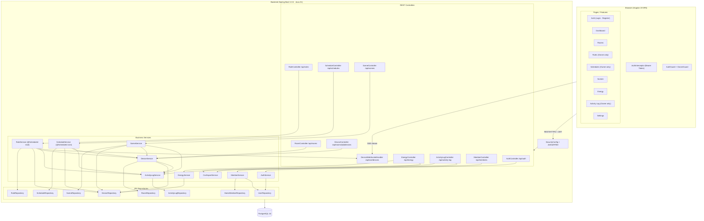
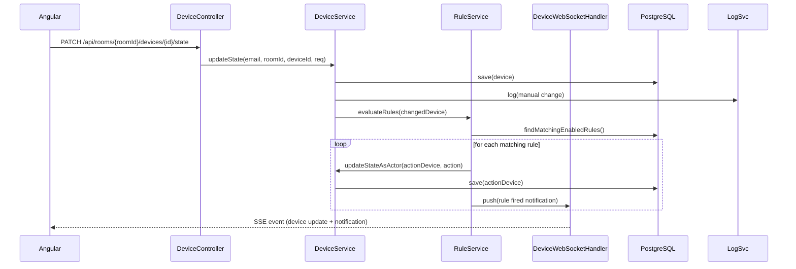
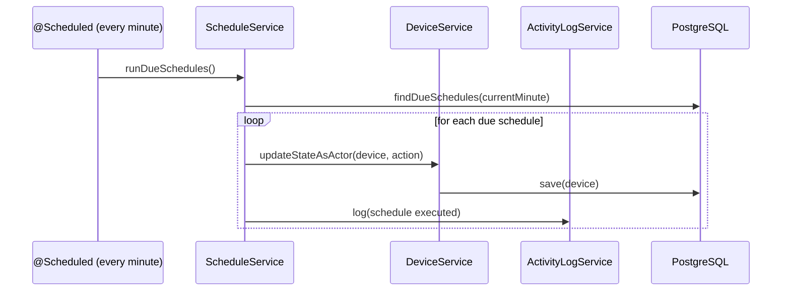
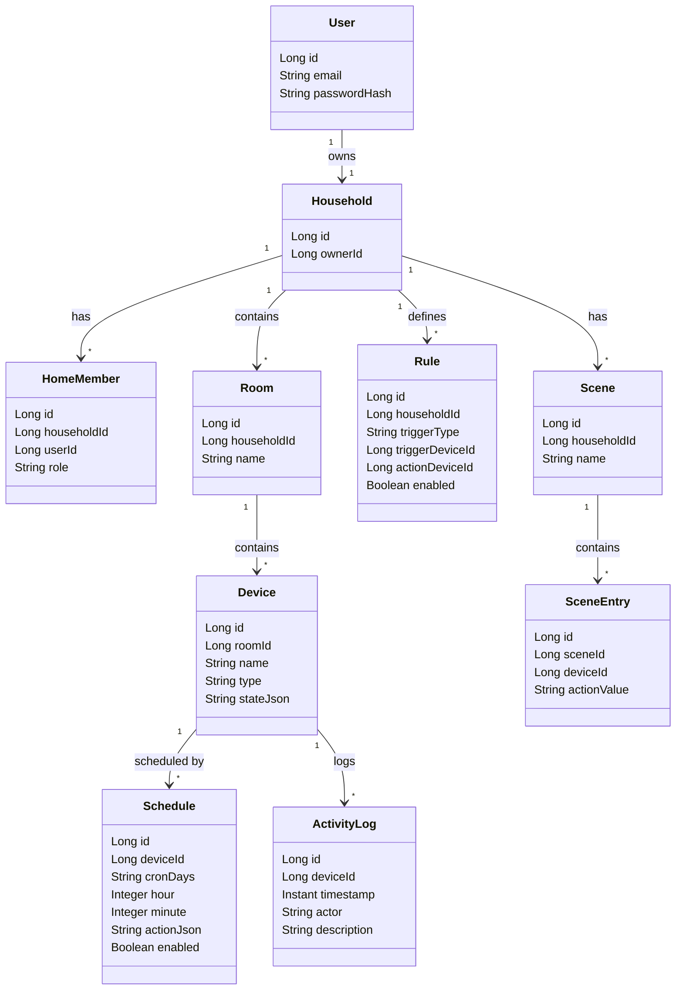

# Architecture — SmartHome Orchestrator

## System Overview

SmartHome Orchestrator is a two-tier web application:

- **Backend**: Spring Boot 3.3.5 (Java 21), REST-API, JWT auth, PostgreSQL via JPA/Flyway
- **Frontend**: Angular 19 SPA, Angular Material UI, RxJS, SSE for real-time device updates
- **Database**: PostgreSQL 16 (Docker-managed)

---

## System Architecture Diagram

---

## Key Design Decisions

- **Authentication**: Spring Security with BCrypt password hashing and self-issued JWTs (NFR-02). All endpoints (except `/api/auth/**`) require a valid Bearer token.
- **Real-time updates**: Server-Sent Events (SSE) push device state changes and rule-fire notifications to the frontend — no external broker needed.
- **Role enforcement**: `MemberService` resolves ownership and membership on every request. The `OwnerGuard` (frontend) and `@PreAuthorize` / runtime checks (backend) enforce Owner-only access to rules, schedules, and the activity log.
- **Rule evaluation**: `RuleService` is triggered synchronously after each `PATCH /state` call. It evaluates all enabled rules whose trigger device and conditions match the new state, then calls `DeviceService.updateStateAsActor` to avoid infinite trigger chains.
- **Schedule execution**: `ScheduleService.runDueSchedules()` runs every minute via Spring `@Scheduled(cron = "0 * * * * *")` and fires all schedules due within the current minute.
- **Database**: PostgreSQL 16 in Docker. Schema managed by Flyway migrations (V1–V13) — version-controlled, auto-applied on startup.
- **CSV export**: `CsvExportService` is shared by both `ActivityLogController` and `EnergyController` for FR-16.

---

## Key Data Flows

### Rule Execution Flow (FR-10/11/12)

### Schedule Execution Flow (FR-09)

---

## Component Catalogue

| Component | Endpoint / Path | Responsibility | FR |
|-----------|----------------|---------------|----|
| AuthController | `POST /api/auth/register`, `/login` | Register, login, JWT issue | FR-01/02 |
| RoomController | `GET/POST/PUT/DELETE /api/rooms` | CRUD for rooms | FR-03 |
| DeviceController | `/api/rooms/{id}/devices` | CRUD + state PATCH | FR-04/05/06 |
| DeviceWebSocketHandler | `GET /api/sse/devices` | SSE stream for real-time state | FR-07 |
| RuleController | `GET/POST/PUT/PATCH/DELETE /api/rules` | IF-THEN rule CRUD + conflict check | FR-10/11/15 |
| ScheduleController | `GET/POST/PUT/PATCH/DELETE /api/schedules` | Time-based schedule CRUD | FR-09 |
| SceneController | `GET/POST/PUT/DELETE /api/scenes`, `POST /{id}/activate` | Scene CRUD + activation | FR-17 |
| EnergyController | `GET /api/energy/devices`, `GET /api/energy/export` | Energy dashboard + CSV | FR-14/16 |
| ActivityLogController | `GET /api/activity-log`, `GET /api/activity-log/export` | Paginated log + CSV + delete | FR-08/16 |
| MemberController | `GET/POST /api/members`, `DELETE /api/members/{id}` | Invite / revoke members (Owner only) | FR-13/20 |
| RuleService | — | Rule evaluation engine | FR-10/11/12 |
| ScheduleService | — | Cron execution every minute | FR-09 |
| MemberService | — | Ownership resolution, Owner authorization | FR-13/20 |
| CsvExportService | — | CSV serialization shared by log + energy | FR-16 |
| EnergyService | — | Power estimate per device (wattage × uptime) | FR-14 |

---

## Domain Model (simplified)

---

## Infrastructure

| Component | Technology | Port |
|-----------|-----------|------|
| Frontend | Angular 19 (Angular CLI, npm) | 4200 |
| Backend | Spring Boot 3.3.5 (Maven, Java 21) | 8080 |
| Database | PostgreSQL 16 (Docker) | 5432 |
| CI | GitHub Actions (Ubuntu, Java 21, Node 22) | — |

**Notes:**
- `passwordHash` stored via BCrypt — plain-text passwords never persisted (NFR-02)
- DB schema managed by Flyway V1–V13 migrations, auto-applied on startup
- CI pipeline: build → PMD check → tests → Jacoco coverage gate (≥ 75 %, NFR-03/04)
