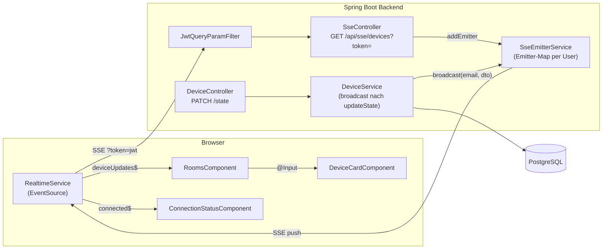

# Application Design — FR-07: Echtzeit-Zustandsanzeige

**Datum**: 2026-04-12  
**Feature**: FR-07 / US-008 — Gerätezustände in Echtzeit im Frontend anzeigen  
**Protokoll**: Server-Sent Events (SSE)

---

## Zusammenfassung

Für FR-07 wird eine **SSE-basierte Echtzeit-Infrastruktur** eingeführt, die additiv auf dem bestehenden REST-Stack aufbaut. Keine bestehenden Endpunkte werden verändert; die Zustandsänderung erfolgt weiterhin per `PATCH /api/rooms/{roomId}/devices/{deviceId}/state`. Nach dem Persistieren des neuen Zustands broadcastet `DeviceService` das Ergebnis an alle aktiven SSE-Verbindungen des Benutzers.

---

## Neue Komponenten

| Komponente | Schicht | Datei |
|---|---|---|
| `SseEmitterService` | Backend / Service | `service/SseEmitterService.java` |
| `SseController` | Backend / Controller | `controller/SseController.java` |
| `JwtQueryParamFilter` | Backend / Security | `security/JwtQueryParamFilter.java` |
| `RealtimeService` | Frontend / Core | `core/realtime.service.ts` |
| `ConnectionStatusComponent` | Frontend / Shared | `shared/components/connection-status/connection-status.component.ts` |

## Modifizierte Komponenten

| Komponente | Änderung |
|---|---|
| `DeviceService` | Ruft `SseEmitterService.broadcast()` in `updateState()` auf |
| `SecurityConfig` | Hängt `JwtQueryParamFilter` in die Filter-Chain ein; `/api/sse/devices` aus Standard-JWT-Pflicht ausgenommen |
| `RoomsComponent` | Abonniert `RealtimeService.deviceUpdates$`; wendet eingehende Updates auf lokale Device-Liste an |
| `DeviceCardComponent` | Bezieht Gerätezustand ausschließlich via `@Input()`-Binding |

---

## Architekturdiagramm

---

## Technische Schlüsselentscheidungen

| Entscheidung | Begründung |
|---|---|
| SSE statt WebSocket | Unidirektionaler Push ausreichend; einfachere Impl.; kein STOMP-Broker nötig |
| `JwtQueryParamFilter` als separater Filter | Bestehender `JwtAuthFilter` bleibt unverändert; klare Separation of Concerns |
| `ConcurrentHashMap` + `CopyOnWriteArrayList` | Thread-safe ohne explizite Synchronisierung; mehrere Tabs pro User möglich |
| RxJS-Observable-Wrapper im Frontend | Passt zu Angular-Patterns; `takeUntilDestroyed()` für automatisches Cleanup |
| REST-GET + SSE-Delta | Kein Umbau des Ladevorgangs; minimale Invasivität |

---

## Detaildokumente

- [components.md](components.md) — Komponentendefinitionen
- [component-methods.md](component-methods.md) — Methodensignaturen
- [services.md](services.md) — Service-Orchestrierung + Datenfluss-Sequenzdiagramm
- [component-dependency.md](component-dependency.md) — Abhängigkeitsmatrix + Kommunikationsmuster
