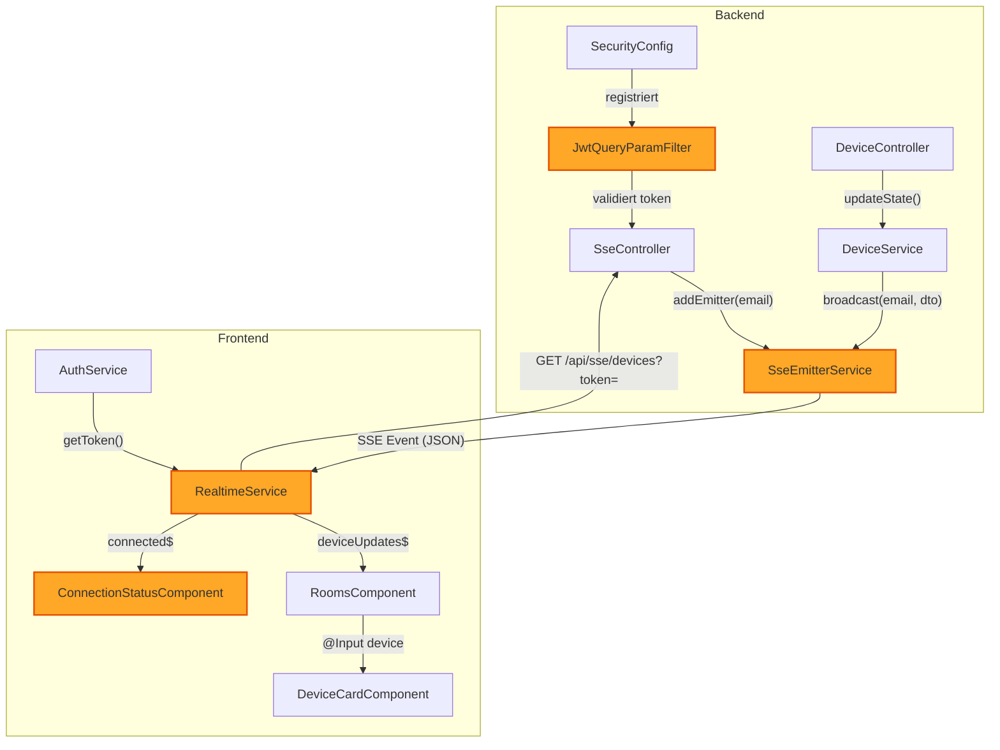

# Component Dependencies — FR-07: Echtzeit-Zustandsanzeige

## Abhängigkeitsmatrix

| Komponente | Hängt ab von | Art der Abhängigkeit |
|---|---|---|
| `SseController` | `SseEmitterService`, `JwtUtil` | Constructor Injection |
| `SseEmitterService` | — | Keine externen Abhängigkeiten |
| `JwtQueryParamFilter` | `JwtUtil`, `UserRepository` | Constructor Injection |
| `DeviceService` | `SseEmitterService` *(neu)*, DeviceRepository, RoomRepository, UserRepository | Constructor Injection |
| `SecurityConfig` | `JwtQueryParamFilter` *(neu)*, JwtAuthFilter | Bean-Injection |
| `RealtimeService` | `AuthService` | Angular DI |
| `RoomsComponent` | `RealtimeService` *(neu)*, DeviceService, RoomService | Angular DI |
| `ConnectionStatusComponent` | `RealtimeService` | Angular DI |
| `DeviceCardComponent` | — *(nur @Input)* | Input-Binding |

## Kommunikationsmuster

## Änderungsauswirkungen

| Geänderte Komponente | Auswirkung auf |
|---|---|
| `DeviceService.updateState()` | `SseEmitterService.broadcast()` wird neu aufgerufen |
| `SecurityConfig` | `JwtQueryParamFilter` wird in die Chain eingehängt |
| `RoomsComponent` | Abonniert zusätzlich `RealtimeService.deviceUpdates$` |
| `DeviceCardComponent` | Verwendet `@Input`-bound State statt lokalem State |
