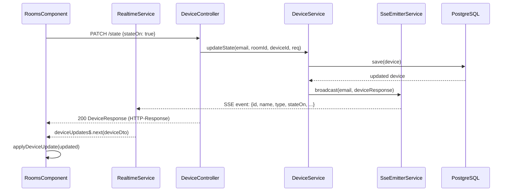

# Services — FR-07: Echtzeit-Zustandsanzeige

## Backend Service-Schicht

### SseEmitterService (neu)
- **Rolle**: Infrastruktur-Service für SSE-Verbindungsverwaltung
- **Orchestrierung**:
  - Wird von `SseController` aufgerufen → Emitter anlegen
  - Wird von `DeviceService` aufgerufen → Event broadcasten
- **State**: `ConcurrentHashMap<String, CopyOnWriteArrayList<SseEmitter>>` (userEmail → Emitter-Liste)
- **Interaktion mit anderen Services**: keiner (reines Infrastruktur-Service)

### DeviceService (modifiziert)
- **Neue Abhängigkeit**: `SseEmitterService` (via Constructor Injection)
- **Orchestrierungsänderung**:
  ```
  updateState() →
    1. Device-State in DB persistieren (wie bisher)
    2. DeviceResponse aufbauen (wie bisher)
    3. NEU: sseEmitterService.broadcast(userEmail, deviceResponse)
    4. DeviceResponse zurückgeben
  ```

### SecurityConfig (modifiziert)
- **Neue Abhängigkeit**: `JwtQueryParamFilter` (als Bean)
- **Änderung**: `JwtQueryParamFilter` vor `JwtAuthFilter` in die Filter-Chain einhängen; `/api/sse/devices` aus der Standard-JWT-Auth-Pflicht herausnehmen

---

## Frontend Service-Schicht

### RealtimeService (neu)
- **Rolle**: SSE-Verbindungs-Lifecycle-Management + Reaktiver Event-Stream
- **Abhängigkeiten**: `AuthService` (für JWT), `environment` (für API-URL)
- **Orchestrierung**:
  ```
  connect() →
    1. JWT aus AuthService holen
    2. EventSource mit ?token=<jwt> öffnen
    3. onmessage → DeviceDto parsen → deviceUpdatesSubject$.next(dto)
    4. onerror → connected$ = false → setTimeout(reconnect, 3000)
    5. onopen → connected$ = true
  ```
- **Bereitgestellte Streams**:
  - `deviceUpdates$: Observable<DeviceDto>` — für RoomsComponent
  - `connected$: Observable<boolean>` — für ConnectionStatusComponent

### AuthService (unverändert)
- Stellt weiterhin `getToken(): string | null` bereit — wird von RealtimeService genutzt

---

## Datenfluss: Zustandsänderung → Echtzeit-Anzeige


