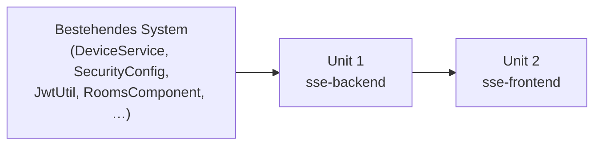

# Unit of Work Dependencies — FR-07: Echtzeit-Zustandsanzeige

## Abhängigkeitsmatrix

| Unit | Hängt ab von | Art |
|------|-------------|-----|
| Unit 1 (`sse-backend`) | Bestehender Code (DeviceService, SecurityConfig, JwtUtil) | Brownfield-Modifikation |
| Unit 2 (`sse-frontend`) | Unit 1 (`sse-backend`) — SSE-Endpunkt muss existieren | Runtime-Abhängigkeit |

## Sequenz-Diagramm

## Update-Reihenfolge
1. **Unit 1** (`sse-backend`) — zuerst implementieren und testen
2. **Unit 2** (`sse-frontend`) — danach; setzt laufenden SSE-Endpunkt voraus

## Koordinationspunkte
- **API-Vertrag**: `GET /api/sse/devices?token=<jwt>` → SSE-Stream, Events als JSON (`DeviceResponse`)
- **Event-Schema**: `{ "id": Long, "name": String, "type": String, "stateOn": Boolean, "brightness": Integer, "temperature": Double, "sensorValue": Double, "coverPosition": Integer }`
- **Testing-Checkpoint**: Unit 1 muss `mvn verify` ohne Fehler bestehen bevor Unit 2 begonnen wird
