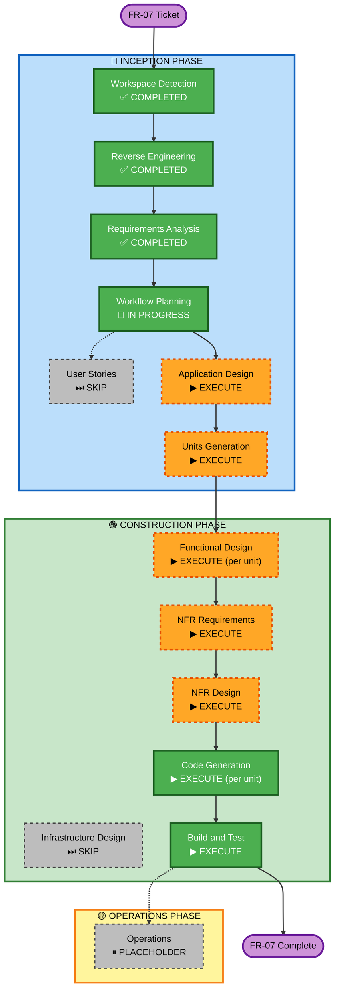

# Execution Plan — FR-07: Echtzeit-Zustandsanzeige

## Detailed Analysis Summary

### Change Impact Assessment
| Bereich | Betroffen | Beschreibung |
|---------|-----------|--------------|
| **User-facing changes** | Ja | Gerätezustände aktualisieren sich automatisch; Reconnect-Banner |
| **Structural changes** | Ja | Neue Klassen: `SseEmitterService`, `SseController`; Frontend: `RealtimeService` |
| **Data model changes** | Nein | Keine neuen DB-Tabellen oder Schema-Änderungen |
| **API changes** | Ja | Neuer Endpunkt `GET /api/sse/devices?token=` + SecurityConfig-Anpassung |
| **NFR impact** | Ja | NFR-01 (Latenz), NFR-03 (Coverage), NFR-04 (PMD), NFR-06 (Javadoc) |

### Component Relationships
```
Primary Components (neu):
  backend: SseEmitterService, SseController
  frontend: RealtimeService

Modified Components:
  backend: DeviceService (publishiert Events), SecurityConfig (neuer öffentlicher Path)
  frontend: RoomsComponent (abonniert SSE), DeviceCardComponent (empfängt State-Updates)

Dependent Components (lesen nur):
  backend: DeviceController → DeviceService (unverändert)
  frontend: AuthService → liefert JWT für SSE-URL
```

### Risk Assessment
| | |
|---|---|
| **Risk Level** | Low-Medium |
| **Rollback Complexity** | Easy — SSE-Code ist additiv; bestehende REST-Endpunkte bleiben unverändert |
| **Testing Complexity** | Moderate — SSE-Verbindungslogik erfordert sorgfältige Unit-Tests des SseEmitterService |

---

## Workflow Visualization



---

## Phases to Execute

### 🔵 INCEPTION PHASE
- [x] Workspace Detection — COMPLETED
- [x] Reverse Engineering — COMPLETED
- [x] Requirements Analysis — COMPLETED
- [x] User Stories — SKIP
  - **Rationale**: US-008 ist im Ticket vollständig beschrieben inkl. Akzeptanzkriterien; keine weiteren Personas nötig
- [x] Workflow Planning — IN PROGRESS (dieses Dokument)
- [ ] Application Design — EXECUTE
  - **Rationale**: Neue Komponenten (SseEmitterService, SseController, RealtimeService) + Modifikation von SecurityConfig und DeviceService; Interfaces müssen vor Code-Generierung geklärt sein
- [ ] Units Generation — EXECUTE
  - **Rationale**: Feature berührt Backend und Frontend; saubere Trennung in Units notwendig

### 🟢 CONSTRUCTION PHASE
- [ ] Functional Design — EXECUTE (pro Unit)
  - **Rationale**: SSE-Verbindungsmanagement, Event-Publishing, Reconnect-Logik — alle erfordern detaillierte Business-Logic-Beschreibung
- [ ] NFR Requirements — EXECUTE
  - **Rationale**: NFR-01 (Latenz), NFR-03 (≥75% Coverage), NFR-04 (PMD), NFR-06 (Javadoc) direkt betroffen
- [ ] NFR Design — EXECUTE
  - **Rationale**: Konkrete Patterns für PMD-Konformität und Javadoc-Struktur im SSE-Code
- [ ] Infrastructure Design — SKIP
  - **Rationale**: Keine neuen Docker-Services, keine DB-Schema-Änderungen; nur Application-Code
- [ ] Code Generation — EXECUTE (ALWAYS)
- [ ] Build and Test — EXECUTE (ALWAYS)

---

## Units

### Unit 1 — Backend: SSE Infrastructure
**Scope**: Neue und modifizierte Backend-Klassen
| Datei | Aktion |
|-------|--------|
| `service/SseEmitterService.java` | NEU — verwaltet Emitter pro Benutzer, broadcast bei State-Change |
| `controller/SseController.java` | NEU — `GET /api/sse/devices?token=` Endpunkt |
| `service/DeviceService.java` | MODIFY — ruft `SseEmitterService.broadcast()` nach State-Update auf |
| `security/SecurityConfig.java` | MODIFY — `/api/sse/devices` aus JWT-Filter ausklammern; Token via Query-Param validieren |
| `service/SseEmitterServiceTest.java` | NEU — Unit-Tests (≥75% Coverage, NFR-03) |

### Unit 2 — Frontend: Real-Time Service
**Scope**: Neue und modifizierte Angular-Dateien
| Datei | Aktion |
|-------|--------|
| `core/realtime.service.ts` | NEU — EventSource-Verbindung, Reconnect-Logik, Observable-Stream |
| `features/rooms/rooms.component.ts` | MODIFY — abonniert RealtimeService, aktualisiert Gerätezustände |
| `shared/components/device-card/device-card.component.ts` | MODIFY — Input-Signal / Input-Binding für externe State-Updates |
| `shared/components/connection-status/connection-status.component.ts` | NEU — Reconnect-Banner-Komponente |

---

## Package Update Sequence
1. **Unit 1 (Backend)** — zuerst: Frontend benötigt den SSE-Endpunkt
2. **Unit 2 (Frontend)** — danach: konsumiert den fertigen Endpunkt

---

## Success Criteria
- **Primary Goal**: Gerätezustände werden ohne manuelles Reload in Echtzeit aktualisiert
- **Key Deliverables**:
  - `SseEmitterService` mit Unit-Tests
  - `SseController` mit Javadoc
  - `RealtimeService` (Angular)
  - Reconnect-Banner-Komponente
- **Quality Gates**:
  - Keine PMD critical/high Violations (NFR-04)
  - ≥75% Line Coverage auf neuen Backend-Klassen (NFR-03)
  - Vollständige Javadocs (NFR-06)
  - SSE-Event kommt ≤2 s nach State-Change an (NFR-01)
  - `mvn verify` + `ng build` + `ng lint` schlagen nicht fehl
