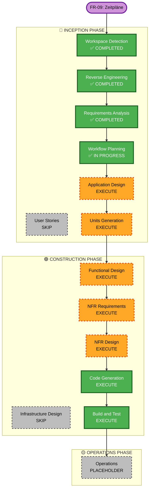

# Execution Plan — FR-09: Zeitpläne konfigurieren

## Detailed Analysis Summary

### Transformation Scope
- **Transformation Type**: Multi-component application change
- **Primary Changes**: New `Schedule` domain + Quartz Scheduler integration + Angular schedule UI
- **Related Components**: `DeviceService` (reused for execution), `ActivityLogService` (reused for logging), `DeviceWebSocketHandler` (reused for state broadcast), `AuthService`/JWT (reused for security), existing Angular navigation

### Change Impact Assessment
- **User-facing changes**: Yes — new Schedules page in nav + per-device schedule panel
- **Structural changes**: Yes — new Quartz Scheduler subsystem alongside Spring context
- **Data model changes**: Yes — new `schedules` table (Flyway migration) + Quartz system tables
- **API changes**: Yes — 6 new REST endpoints under `/api/schedules`
- **NFR impact**: Yes — coverage, PMD, Javadoc must be maintained; Quartz adds a new dependency

### Component Relationships
- **Primary New Component**: `Schedule` domain (entity, repo, service, controller, Quartz job)
- **Consumers**: Angular Schedules page, Angular device panel
- **Integrations**:
  - `DeviceService.updateState()` — called by Quartz job executor to apply scheduled action
  - `ActivityLogService.log()` — called after each execution to record the event
  - Spring Security / JWT — all endpoints protected
  - Flyway — Quartz tables + `schedules` table via new migration

### Risk Assessment
- **Risk Level**: Medium
- **Rollback Complexity**: Moderate (Flyway migration needs down-script awareness; Quartz tables are additive)
- **Testing Complexity**: Moderate (Quartz job execution requires mocking the scheduler in unit tests)

---

## Workflow Visualization

---

## Phases to Execute

### 🔵 INCEPTION PHASE
- [x] Workspace Detection — COMPLETED (reused)
- [x] Reverse Engineering — COMPLETED (reused)
- [x] Requirements Analysis — COMPLETED (2026-04-24)
- [ ] User Stories — **SKIP**
  - **Rationale**: US-010 is fully defined in the issue; single user persona; no additional story elaboration needed
- [x] Workflow Planning — IN PROGRESS
- [ ] Application Design — **EXECUTE**
  - **Rationale**: New components needed: `Schedule` entity, `ScheduleService`, `ScheduleController`, `ScheduleJobExecutor` (Quartz), `ScheduleRepository`; component boundaries and method signatures need definition
- [ ] Units Generation — **EXECUTE**
  - **Rationale**: New data model, new API, Quartz job executor, Angular schedule page — two units: `schedule-backend` and `schedule-frontend`

### 🟢 CONSTRUCTION PHASE
- [ ] Functional Design — **EXECUTE**
  - **Rationale**: New endpoints, Quartz job registration logic, enable/disable toggle, activity log integration
- [ ] NFR Requirements — **EXECUTE**
  - **Rationale**: Quartz adds a new dependency (pom.xml), new Flyway migration needed; PMD + Javadoc apply to all new classes
- [ ] NFR Design — **EXECUTE**
  - **Rationale**: Define Quartz configuration approach, Flyway migration plan, JaCoCo coverage strategy for new classes
- [ ] Infrastructure Design — **SKIP**
  - **Rationale**: No new infrastructure (no Docker changes, no CI/CD changes); Flyway migration is application-level, handled in NFR Design
- [ ] Code Generation — **EXECUTE** (always)
- [ ] Build and Test — **EXECUTE** (always)

### 🟡 OPERATIONS PHASE
- [ ] Operations — PLACEHOLDER

---

## Package Change Sequence

1. **Backend — Flyway migration** (`V5__create_schedules.sql` + Quartz schema tables)
2. **Backend — Domain** (`Schedule` entity, `ScheduleRepository`)
3. **Backend — Quartz config** (`QuartzConfig`, `ScheduleJobExecutor`)
4. **Backend — Service** (`ScheduleService` with CRUD + job registration)
5. **Backend — Controller** (`ScheduleController` — 6 endpoints)
6. **Backend — Tests** (`ScheduleServiceTest`, `ScheduleControllerTest`)
7. **Frontend — Model** (`ScheduleDto` in `models.ts`)
8. **Frontend — Service** (`schedule.service.ts`)
9. **Frontend — Schedules page** (`schedules/` component + routing)
10. **Frontend — Device panel integration** (schedule shortcut in device card/dialog)

---

## Success Criteria
- **Primary Goal**: Users can create recurring time-based schedules for device actions; schedules execute reliably at configured times
- **Key Deliverables**:
  - Quartz-backed schedule execution (survives restarts)
  - Full CRUD REST API for schedules
  - Global Schedules page + per-device shortcut in Angular
  - Activity log entries for each execution
  - Enable/disable toggle
- **Quality Gates**:
  - All tests pass (JaCoCo ≥ 75%)
  - PMD: 0 critical/high violations
  - Javadoc: no errors
  - `mvn clean install` succeeds
