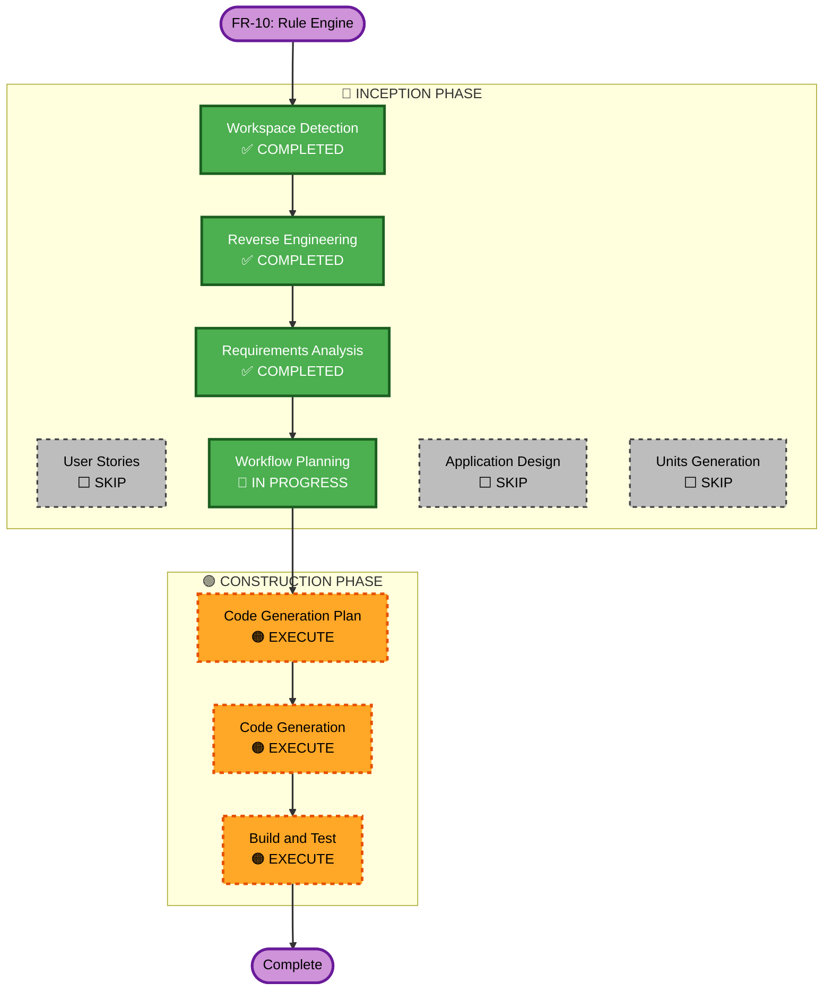

# Execution Plan — FR-10: Rule Engine (IF-THEN)

## Detailed Analysis Summary

### Transformation Scope
- **Transformation Type**: Single feature addition (backend only)
- **Primary Changes**: New Rule entity, repository, service, controller + DeviceService hook
- **Related Components**: DeviceService (modification), ActivityLogService (reuse), DeviceWebSocketHandler (reuse)

### Change Impact Assessment
- **User-facing changes**: No — frontend stays as mock
- **Structural changes**: No — additive only, no architectural changes
- **Data model changes**: Yes — new `rules` table via Flyway V7
- **API changes**: Yes — new `/api/rules` endpoints (CRUD + toggle)
- **NFR impact**: Minor — PMD + Javadoc compliance required

### Component Relationships
- **Primary New Components**: Rule, RuleRepository, RuleRequest, RuleResponse, RuleService, RuleController
- **Modified Components**: DeviceService (adds `evaluateRulesForDevice()` call after save)
- **Reused Components**: ActivityLogService (logging), DeviceWebSocketHandler (broadcast), DeviceService.updateStateAsActor() (action execution)
- **Dependencies**: Rule → Device (triggerDevice, actionDevice), Rule → User

### Risk Assessment
- **Risk Level**: Low-Medium
- **Rollback Complexity**: Easy — Flyway versioned migration, isolated new files
- **Testing Complexity**: Moderate — rule evaluation logic requires test scenarios for both trigger types
- **Known Risk**: Infinite loop potential if rule A fires → device update → rule B evaluates → fires → updates rule A's device. Mitigated by not calling `evaluateRulesForDevice()` inside `updateStateAsActor()` (actor-triggered updates do not re-evaluate rules)

---

## Workflow Visualization

---

## Phases to Execute

### 🔵 INCEPTION PHASE
- [x] Workspace Detection — COMPLETED (reuse existing)
- [x] Reverse Engineering — COMPLETED (reuse existing)
- [x] Requirements Analysis — COMPLETED (fr10-requirements.md)
- [ ] User Stories — **SKIP** — single backend feature, no new user personas, acceptance criteria captured in requirements
- [x] Workflow Planning — IN PROGRESS (this document)
- [ ] Application Design — **SKIP** — design fully captured in `fr10-requirements.md` Technical Design section (components, integration point, SQL schema defined)
- [ ] Units Generation — **SKIP** — single backend unit, no frontend unit, no separate unit planning needed

### 🟢 CONSTRUCTION PHASE
- [ ] Functional Design — **SKIP** — functional logic fully specified in requirements (trigger evaluation algorithm, action parsing)
- [ ] NFR Requirements — **SKIP** — NFR-04 (PMD) and NFR-06 (Javadoc) already defined in project standards
- [ ] NFR Design — **SKIP** — existing PMD ruleset and Javadoc patterns apply directly
- [ ] Infrastructure Design — **SKIP** — no infrastructure changes
- [ ] **Code Generation Plan — EXECUTE** — create step-by-step plan for all new/modified files
- [ ] **Code Generation — EXECUTE** — implement backend
- [ ] **Build and Test — EXECUTE** — run tests, verify PMD, Javadoc, coverage

### 🟡 OPERATIONS PHASE
- [ ] Operations — PLACEHOLDER

---

## Code Generation Sequence

| Step | File | Type | Notes |
|------|------|------|-------|
| 1 | `V7__create_rules_table.sql` | New | Flyway migration — rules table |
| 2 | `TriggerType.java` | New | Enum: THRESHOLD, EVENT |
| 3 | `TriggerOperator.java` | New | Enum: GT, LT |
| 4 | `Rule.java` | New | JPA Entity with all fields |
| 5 | `RuleRepository.java` | New | Spring Data — findByEnabledTrueAndTriggerDevice |
| 6 | `RuleRequest.java` | New | DTO for POST/PUT |
| 7 | `RuleResponse.java` | New | DTO for GET responses |
| 8 | `RuleService.java` | New | CRUD + evaluateRulesForDevice() |
| 9 | `RuleController.java` | New | REST — /api/rules |
| 10 | `DeviceService.java` | Modify | Add evaluateRulesForDevice() call in updateState() only |
| 11 | `RuleServiceTest.java` | New | Unit tests: THRESHOLD trigger, EVENT trigger, CRUD |
| 12 | `RuleControllerTest.java` | New | Integration tests: CRUD endpoints, ownership scoping |

**Total**: 10 new files, 1 modified file, 2 test files

---

## Success Criteria

- **Primary Goal**: Rules can be created, enabled/disabled, deleted; THRESHOLD rules fire when sensor value crosses threshold; EVENT rules fire when stateOn changes
- **Acceptance Criteria** (from issue #17):
  - `GET /api/rules` returns all rules for authenticated user
  - `POST /api/rules` creates a rule (THRESHOLD or EVENT)
  - `PUT /api/rules/{id}` replaces a rule
  - `PATCH /api/rules/{id}/enabled` toggles rule on/off
  - `DELETE /api/rules/{id}` removes a rule (204)
  - THRESHOLD rule fires when sensor value satisfies operator + threshold on every state update
  - EVENT rule fires when stateOn changes to the configured value
  - Rule action logs to ActivityLog and broadcasts via WebSocket
  - Devices not owned by user return 404
- **Quality Gates**:
  - All existing tests still pass
  - PMD: 0 critical/high violations
  - Javadoc on all public classes/methods in Rule, RuleRepository, RuleService, RuleController
  - New rule evaluation tests cover both trigger types
