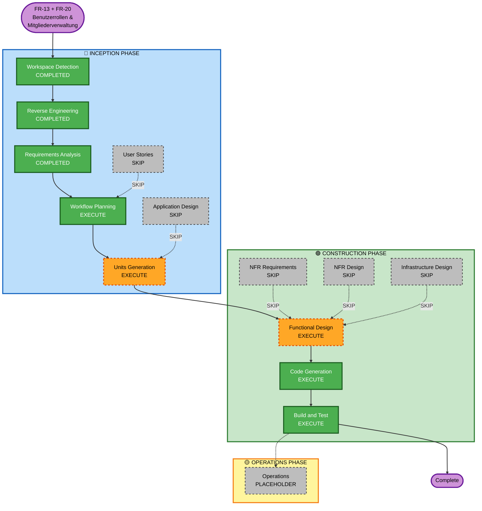

# Execution Plan — FR-13 & FR-20: Benutzerrollen & Mitgliederverwaltung

## Detailed Analysis Summary

### Transformation Scope
- **Transformation Type**: Multiple Components (kein Architekturwechsel, aber quer durch alle Layer)
- **Primary Changes**: Neues Rollenmodell, neue DB-Tabelle `home_members`, neuer MemberController/Service, rollenbasierte Autorisierung in allen bestehenden Controllern, Frontend-Anpassungen
- **Related Components**: DeviceController, RoomController, RuleController, ScheduleController, ActivityLogController, AuthService, JwtUtil, SecurityConfig

### Change Impact Assessment
| Bereich | Auswirkung |
|---------|-----------|
| User-facing changes | Ja — Members sehen nur Steuerungs-Buttons, Settings-Seite für Owner |
| Structural changes | Nein — Architektur bleibt gleich (Spring Boot + Angular) |
| Data model changes | Ja — neue `home_members` Tabelle (V9 Migration) |
| API changes | Ja — neue `/api/members` Endpunkte, bestehende Endpunkte mit Rollenprüfung |
| NFR impact | Ja — Sicherheit: serverseitige Autorisierungsprüfung bei jedem Request |

### Risk Assessment
| Dimension | Bewertung |
|-----------|-----------|
| **Risk Level** | Medium |
| **Rollback Complexity** | Moderat (DB-Migration rückwärts, bestehende Controller-Änderungen) |
| **Testing Complexity** | Moderat (neues Rollenkonzept erfordert viele neue Testszenarien) |

**Risiken:**
- Bestehende Controller-Tests müssen angepasst werden (Owner-Kontext statt User-Kontext)
- ActivityLog-Schema-Änderung könnte bestehende Tests brechen
- Rollenlogik muss konsequent in ALLEN Services geprüft werden

---

## Workflow Visualization



---

## Phases to Execute

### 🔵 INCEPTION PHASE
- [x] Workspace Detection — COMPLETED (reuse existing)
- [x] Reverse Engineering — COMPLETED (reuse existing)
- [x] Requirements Analysis — COMPLETED (2026-05-01)
- [ ] User Stories — **SKIP** — Anforderungen sind klar definiert, Rollen und Szenarien vollständig in Requirements beschrieben
- [x] Workflow Planning — IN PROGRESS
- [ ] Application Design — **SKIP** — Bestehende Architektur bleibt; neue Komponenten folgen dem bereits etablierten Controller/Service/Repository-Muster
- [ ] Units Generation — **EXECUTE** — Feature erstreckt sich über 2 klar trennbare Units (Backend + Frontend)

### 🟢 CONSTRUCTION PHASE
- [ ] Functional Design — **EXECUTE** — Neue Geschäftslogik für Rollenprüfung in allen Services, Owner-Kontext-Auflösung für Member, ActivityLog-Anpassung
- [ ] NFR Requirements — **SKIP** — Bestehende PMD/Javadoc/JaCoCo-Regeln unverändert; Sicherheitsanforderungen sind in Functional Design abgedeckt
- [ ] NFR Design — **SKIP**
- [ ] Infrastructure Design — **SKIP** — Keine neue Infrastruktur (kein neuer Docker-Service, keine Deployment-Änderung)
- [ ] Code Generation — **EXECUTE** (Unit 1: Backend, Unit 2: Frontend)
- [ ] Build and Test — **EXECUTE**

---

## Units

### Unit 1 — Backend: Rollen & Mitgliederverwaltung

| # | Datei / Komponente | Typ | Beschreibung |
|---|-------------------|-----|--------------|
| 1 | `V9__create_home_members_table.sql` | Neu | Flyway-Migration: `home_members` Tabelle |
| 2 | `HomeMember.java` | Neu | JPA Entity |
| 3 | `HomeMemberRepository.java` | Neu | Spring Data Repository |
| 4 | `MemberService.java` | Neu | invite, listMembers, removeMember + Validierungen |
| 5 | `MemberController.java` | Neu | REST: POST /api/members/invite, GET /api/members, DELETE /api/members/{id} |
| 6 | `MemberInviteRequest.java` | Neu | DTO |
| 7 | `MemberResponse.java` | Neu | DTO |
| 8 | `AuthorizationService.java` | Neu | Helper: isOwner(), getOwnerForMember() |
| 9 | `DeviceService.java` | Angepasst | Rollenprüfung + Owner-Kontext für Member |
| 10 | `RoomService.java` | Angepasst | Rollenprüfung + Owner-Kontext für Member |
| 11 | `RuleService.java` | Angepasst | OWNER-only Operationen prüfen |
| 12 | `ScheduleService.java` | Angepasst | OWNER-only Operationen prüfen |
| 13 | `ActivityLog.java` | Angepasst | Neues Feld: `actorEmail` |
| 14 | `V9b` (oder im selben V9) | Angepasst | ActivityLog: actor_email Spalte hinzufügen |
| 15 | Tests | Neu/Angepasst | MemberServiceTest, MemberControllerTest + bestehende Controller-Tests anpassen |

### Unit 2 — Frontend: Rollen-UI & Settings

| # | Datei / Komponente | Typ | Beschreibung |
|---|-------------------|-----|--------------|
| 1 | `member.service.ts` | Neu | HTTP-Calls für /api/members |
| 2 | `member-settings/` Component | Neu | Liste + Einladungsformular + Entfernen-Button |
| 3 | `auth.service.ts` | Angepasst | Rolle aus Login-Response speichern und bereitstellen |
| 4 | `auth-response.model.ts` | Angepasst | Rolle-Feld hinzufügen |
| 5 | `rooms.component.ts/html` | Angepasst | Verwaltungs-Buttons für Members ausblenden |
| 6 | `device-card.component.ts/html` | Angepasst | Umbenennen/Löschen für Members ausblenden |
| 7 | `app.routes.ts` | Angepasst | Route für Settings/Members-Seite |
| 8 | `AuthResponse` Backend DTO | Angepasst | Rolle-Feld zurückgeben |

---

## Package Change Sequence

```
1. Backend (Unit 1)          ← zuerst: DB-Migration, neue Endpoints, Rollenlogik
2. Frontend (Unit 2)         ← danach: Settings-UI, rollenbasierte Sichtbarkeit
```

**Abhängigkeit**: Frontend benötigt die neuen Backend-Endpunkte (`/api/members`) und das `role`-Feld in `AuthResponse`.

---

## Success Criteria

| Kriterium | Ziel |
|-----------|------|
| **Primäres Ziel** | Owner kann Member einladen/entfernen; Member kann nur Geräte steuern, nicht verwalten |
| **Sicherheit** | HTTP 403 bei unerlaubtem Member-Zugriff auf OWNER-only Endpoints |
| **Tests** | Alle bestehenden Tests bestehen weiterhin; neue Tests für Rollen-Szenarien |
| **PMD** | 0 Critical/High Violations |
| **Javadoc** | Alle neuen public Klassen/Methoden dokumentiert |
| **Build** | Maven build + Angular build fehlerfrei |
