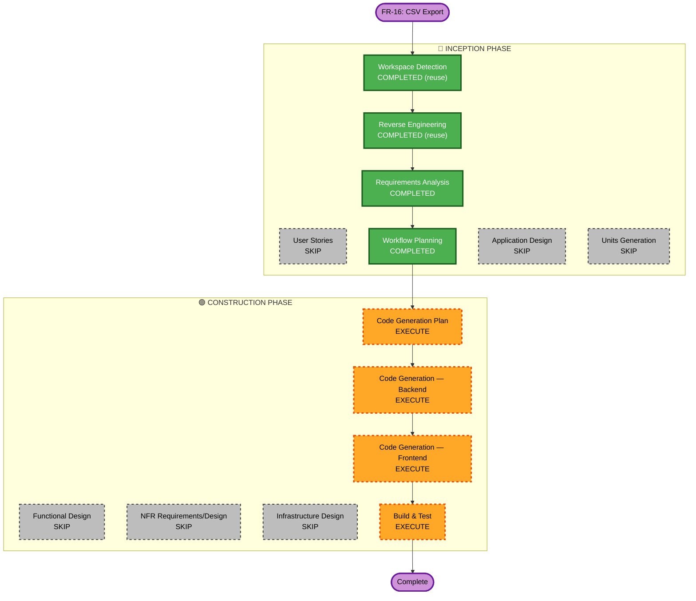

# Execution Plan — FR-16: CSV Export

## Change Impact Assessment
- **User-facing changes**: Yes — new "Export CSV" button on Activity Log page; wiring of existing button on Energy page
- **Structural changes**: No — changes fit within existing component boundaries
- **Data model changes**: No — no new entities or migrations
- **API changes**: Yes — 2 new GET endpoints (`/api/activity-log/export`, `/api/energy/export`)
- **NFR impact**: Minimal — straightforward read path, no performance concern at typical data volumes

## Risk Assessment
- **Risk Level**: Low
- **Rollback Complexity**: Easy (isolated new endpoints, no schema changes)
- **Testing Complexity**: Simple

## Workflow Visualization

## Phases to Execute

### 🔵 INCEPTION PHASE
- [x] Workspace Detection — COMPLETED (reuse existing)
- [x] Reverse Engineering — COMPLETED (reuse existing)
- [x] Requirements Analysis — COMPLETED
- [ ] User Stories — SKIP (single clear requirement, no persona analysis needed)
- [x] Workflow Planning — COMPLETED
- [ ] Application Design — SKIP (changes within existing component boundaries)
- [ ] Units Generation — SKIP (changes are small and clearly bounded)

### 🟢 CONSTRUCTION PHASE
- [ ] Functional Design — SKIP (data flow is straightforward; no new domain concepts)
- [ ] NFR Requirements — SKIP (existing NFR setup sufficient)
- [ ] NFR Design — SKIP
- [ ] Infrastructure Design — SKIP (no deployment model changes)
- [ ] Code Generation Plan — EXECUTE
- [ ] Code Generation (Unit 1: Backend) — EXECUTE
- [ ] Code Generation (Unit 2: Frontend) — EXECUTE
- [ ] Build and Test — EXECUTE

## Units

### Unit 1 — csv-backend
Files to create/modify:
- `ActivityLogRepository.java` — add `findAllByUser(User, Sort)` method
- `CsvExportService.java` — new; builds CSV strings for both exports
- `ActivityLogService.java` — add `exportActivityLogCsv(String email)` method
- `EnergyService.java` — add `exportEnergyCsv(String email)` method
- `ActivityLogController.java` — add `GET /api/activity-log/export`
- `EnergyController.java` — add `GET /api/energy/export`
- `CsvExportServiceTest.java` — new unit tests
- `ActivityLogControllerTest.java` — extend with export endpoint test
- `EnergyControllerTest.java` — extend with export endpoint test

### Unit 2 — csv-frontend
Files to modify:
- `activity-log.service.ts` — add `exportCsv(): void`
- `energy.service.ts` — add `exportCsv(): void`
- `log.component.ts` — add Export CSV button
- `energy.component.ts` — wire existing stub

## Success Criteria
- `GET /api/activity-log/export` returns valid CSV, owner-only (403 for Member)
- `GET /api/energy/export` returns valid CSV, accessible to all authenticated users
- Browser download triggered correctly from both pages
- All existing + new tests pass
- PMD 0 violations, Javadoc complete
