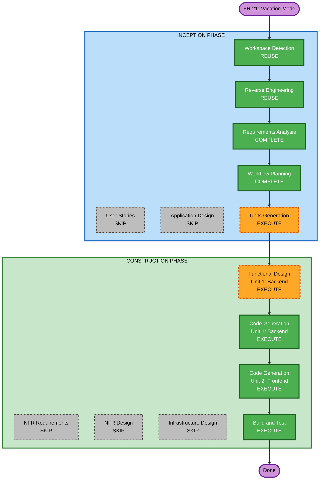

# Execution Plan — FR-21: Vacation Mode

## Detailed Analysis Summary

### Transformation Scope
- **Type**: Single feature addition (brownfield)
- **Primary Changes**: New domain entity, Flyway V14 migration, scheduler component, service, controller, DTOs; frontend component + service + route
- **Related Components**: `Schedule` (enabled flag toggled), `ScheduleRepository`, `MemberService` (auth), `SecurityConfig` (no changes needed — JWT filter covers new endpoints)

### Change Impact Assessment
- **User-facing changes**: Yes — new "Vacation Mode" page in frontend (owner-only)
- **Structural changes**: No — follows established layered architecture
- **Data model changes**: Yes — new `vacation_modes` table (V14)
- **API changes**: Yes — new `/api/vacation-modes` endpoints
- **NFR impact**: No — existing PMD + Javadoc rules apply unchanged

### Risk Assessment
- **Risk Level**: Low
- **Rollback Complexity**: Easy (drop V14 migration, remove new files)
- **Testing Complexity**: Simple to Moderate (CRUD + date-range + schedule toggling logic)

---

## Workflow Visualization



---

## Phases to Execute

### INCEPTION PHASE
- [x] Workspace Detection — REUSE existing
- [x] Reverse Engineering — REUSE existing artifacts
- [x] Requirements Analysis — COMPLETE (`fr21-requirements.md`)
- [ ] User Stories — SKIP (story fully defined in issue #28)
- [x] Workflow Planning — COMPLETE (this document)
- [ ] Application Design — SKIP (no new service boundaries; patterns established)
- [ ] Units Generation — EXECUTE (2 units below)

### CONSTRUCTION PHASE
- [ ] Functional Design — EXECUTE (Unit 1: Backend)
- [ ] NFR Requirements — SKIP (existing PMD + Javadoc NFRs active)
- [ ] NFR Design — SKIP
- [ ] Infrastructure Design — SKIP
- [ ] Code Generation Unit 1: Backend — EXECUTE
- [ ] Code Generation Unit 2: Frontend — EXECUTE
- [ ] Build and Test — EXECUTE

### OPERATIONS PHASE
- [ ] Operations — PLACEHOLDER

---

## Units of Work

### Unit 1 — Backend

| File | Action |
|---|---|
| `db/migration/V14__create_vacation_modes.sql` | CREATE |
| `domain/VacationMode.java` | CREATE |
| `dto/VacationModeRequest.java` | CREATE |
| `dto/VacationModeResponse.java` | CREATE |
| `repository/VacationModeRepository.java` | CREATE |
| `service/VacationModeService.java` | CREATE |
| `service/VacationModeScheduler.java` | CREATE |
| `controller/VacationModeController.java` | CREATE |
| `service/VacationModeServiceTest.java` | CREATE |
| `controller/VacationModeControllerTest.java` | CREATE |

### Unit 2 — Frontend

| File | Action |
|---|---|
| `core/models.ts` | MODIFY — add `VacationModeDto`, `VacationModeRequest` |
| `core/vacation-mode.service.ts` | CREATE |
| `features/vacation/vacation.component.ts` | CREATE |
| `features/vacation/vacation-dialog.component.ts` | CREATE |
| `app.routes.ts` | MODIFY — add `/vacation` with `ownerGuard` |
| `layout/shell/shell.component.ts` | MODIFY — add nav link (owner-only) |

---

## Functional Design — Unit 1 (Backend)

### VacationMode Entity Fields
```
id          : Long          PK, auto
user        : User          ManyToOne, not null
schedule    : Schedule      ManyToOne, not null
name        : String        max 100, not null
startDate   : LocalDate     not null
endDate     : LocalDate     not null
deactivated : boolean       default false
createdAt   : LocalDateTime default now
```

### Business Rules
1. `endDate >= startDate` — validated in service
2. Referenced schedule must be owned by the same user — via `resolveOwnedSchedule()`
3. Singleton: `vacationModeRepository.findByUser(user)` must be empty on create — 409 otherwise
4. `isActive()` = `!deactivated && !today.isBefore(startDate) && !today.isAfter(endDate)`
5. On **create**: if `startDate <= today` → immediately `schedule.setEnabled(true)`
6. On **deactivate** or **delete**: if was active → `schedule.setEnabled(false)`
7. Daily scheduler (`VacationModeScheduler`, cron `0 0 0 * * *`): auto-expire when `endDate < today`

### Scheduler Logic (`checkAndUpdateStates`)
```
for each non-deactivated vacation mode:
  if today > endDate:
    schedule.enabled = false
    vacation.deactivated = true
  else if today >= startDate:
    schedule.enabled = true   // idempotent
```

### API Contract
```
GET  /api/vacation-modes
  -> 200 List<VacationModeResponse>

POST /api/vacation-modes
  Body: VacationModeRequest
  -> 201 VacationModeResponse
  -> 400 validation error
  -> 404 schedule not found/not owned
  -> 409 vacation mode already exists

PATCH /api/vacation-modes/{id}/deactivate
  -> 200 VacationModeResponse
  -> 404 not found/not owned

DELETE /api/vacation-modes/{id}
  -> 204 No Content
  -> 404 not found/not owned
```

### VacationModeScheduler (mirrors RuleScheduler)
```java
@Component
public class VacationModeScheduler {
    @Scheduled(cron = "0 0 0 * * *")  // daily at midnight
    public void runDailyCheck() {
        vacationModeService.checkAndUpdateStates();
    }
}
```

---

## Success Criteria

- **Primary Goal**: All 3 FR-21 acceptance criteria met
- **Key Deliverables**:
  - V14 Flyway migration
  - Backend singleton CRUD + daily scheduler that toggles `schedule.enabled`
  - Frontend vacation mode page with create dialog (owner-only)
  - Tests covering happy path, singleton enforcement, date validation, early deactivation
- **Quality Gates**:
  - All backend tests pass (green)
  - PMD: zero critical/high violations
  - Full Javadoc on all public classes/methods
  - Angular TypeScript build: zero errors
