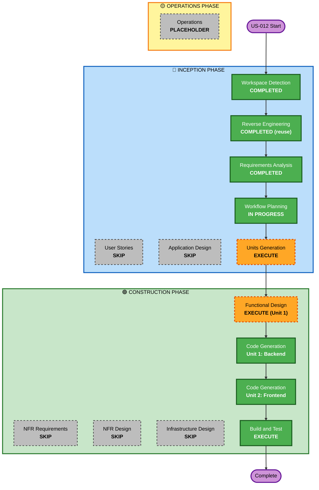

# Execution Plan — US-012: Rules Frontend-Backend Integration

**Datum**: 2026-04-28
**Feature**: US-012 — Trigger-Typen (Zeit / Schwellenwert / Ereignis)

---

## Detailed Analysis Summary

### Transformation Scope
- **Transformation Type**: Multi-Component (Backend-Erweiterung + Frontend-Integration)
- **Primary Changes**: TIME-TriggerType im Backend; Frontend-Mock durch echte API ersetzen
- **Related Components**: TriggerType Enum, Rule Entity, RuleRequest/RuleResponse DTOs, RuleService, neuer RuleScheduler, Flyway Migration, models.ts, rule.service.ts (neu), RulesComponent, NewRuleDialogComponent

### Change Impact Assessment
- **User-facing changes**: Ja — Regellist zeigt echte Daten; TIME/THRESHOLD/EVENT wirklich konfigurierbar
- **Structural changes**: Ja — neue `trigger_device_id` nullable, neue Spalten in DB
- **Data model changes**: Ja — Flyway Migration (neue Spalten, nullable constraint change)
- **API changes**: Ja — `RuleRequest`/`RuleResponse` um TIME-Felder erweitert
- **NFR impact**: Gering — bestehende PMD/Javadoc/Test-Standards gelten

### Risk Assessment
- **Risk Level**: Medium
- **Rollback Complexity**: Moderat (DB-Migration muss rückgängig gemacht werden)
- **Testing Complexity**: Moderat (RuleScheduler braucht Zeitsteuerungs-Tests)

---

## Workflow Visualization

---

## Phases to Execute

### 🔵 INCEPTION PHASE
- [x] Workspace Detection — COMPLETED (reuse)
- [x] Reverse Engineering — COMPLETED (reuse)
- [x] Requirements Analysis — COMPLETED (2026-04-28)
- [ ] User Stories — **SKIP** — US-012 ist klar definiert, kein zusätzlicher Personas-Aufwand
- [x] Workflow Planning — IN PROGRESS
- [ ] Application Design — **SKIP** — keine neue Komponentenarchitektur; bestehende Grenzen werden nur erweitert
- [ ] Units Generation — **EXECUTE** — zwei unabhängige Units definieren (Backend / Frontend)

### 🟢 CONSTRUCTION PHASE
- [ ] Functional Design — **EXECUTE (Unit 1: Backend)** — TIME-Scheduling-Logik im `RuleScheduler` ist nicht-trivial und braucht Design-Entscheidungen
- [ ] NFR Requirements — **SKIP** — bestehende Standards (PMD, Javadoc, Tests) ausreichend
- [ ] NFR Design — **SKIP** — keine neuen NFR-Pattern nötig
- [ ] Infrastructure Design — **SKIP** — keine Infrastrukturänderungen
- [ ] Code Generation Unit 1 (Backend) — **EXECUTE**
- [ ] Code Generation Unit 2 (Frontend) — **EXECUTE**
- [ ] Build and Test — **EXECUTE**

### 🟡 OPERATIONS PHASE
- [ ] Operations — PLACEHOLDER

---

## Units of Work

### Unit 1: Backend — TIME Trigger Erweiterung
**Betroffene Dateien:**
- `TriggerType.java` — `TIME` hinzufügen
- `Rule.java` — `triggerDevice` optional, neue Felder `triggerHour`, `triggerMinute`, `triggerDaysOfWeek`
- `RuleRequest.java` — neue Felder, `triggerDeviceId` optional
- `RuleResponse.java` — neue Felder
- `RuleService.java` — TIME-Logik in `createRule`/`updateRule`/`applyRequest`; neue Methode `evaluateTimeRules()`
- `RuleScheduler.java` (neu) — `@Scheduled(cron="0 * * * * *")`, ruft `evaluateTimeRules()` auf
- `V8__add_rule_time_trigger.sql` (Flyway) — neue Spalten, nullable constraint

### Unit 2: Frontend — Rules Integration
**Betroffene Dateien:**
- `models.ts` — `TriggerType` (Uppercase), `RuleDto`, `RuleRequest` Interface; `hasConflict` entfernen
- `rule.service.ts` (neu) — HTTP-Service (GET, POST, PUT, PATCH, DELETE)
- `rules.component.ts` — Mock-Daten ersetzen durch `RuleService`; Delete + Edit Buttons
- `new-rule-dialog.component.ts` — echte Geräteliste (Raum → Gerät), Operatoren auf GT/LT, TIME-Format anpassen, API-Call on save; Edit-Modus

**Abhängigkeit**: Unit 2 setzt Unit 1 voraus (neues `triggerHour`/`triggerMinute` im DTO).

---

## Module Update Strategy
- **Update Approach**: Sequential (Backend first, dann Frontend)
- **Critical Path**: Unit 1 (Backend DTO-Änderungen) → Unit 2 (Frontend Service + Components)
- **Testing Checkpoints**: Nach Unit 1: Backend-Tests grün, PMD clean. Nach Unit 2: Frontend kompiliert, E2E-Smoke-Test.

---

## Success Criteria
- **Primary Goal**: US-012 Akzeptanzkriterien vollständig erfüllt
- **Key Deliverables**: rule.service.ts, aktualisierte models.ts, RulesComponent ohne Mock, RuleScheduler, Flyway Migration
- **Quality Gates**: alle bestehenden Tests grün, PMD 0 Violations, Javadoc vollständig auf neuen public Methoden
