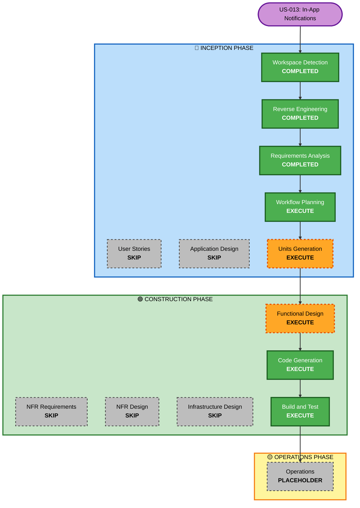

# Execution Plan — US-013: In-App-Benachrichtigungen bei Regelausführung

## Detailed Analysis Summary

### Transformation Scope
- **Transformation Type**: Single-feature extension über mehrere bestehende Komponenten
- **Primary Changes**: Backend `RuleService` + `DeviceWebSocketHandler`, Frontend `RealtimeService` + `ShellComponent`
- **Related Components**: Neues `RuleNotificationDto` (kein Entity/Repository/Migration)

### Change Impact Assessment
- **User-facing changes**: Ja — neue Snackbar-Einblendungen + funktionales Notification-Panel in der Toolbar
- **Structural changes**: Nein — keine Architekturänderung; WebSocket-Kanal wird mit neuem `messageType` erweitert
- **Data model changes**: Nein — kein neues Entity, keine Flyway-Migration
- **API changes**: Nein — kein neuer HTTP-Endpunkt; nur neuer WebSocket-Nachrichtentyp
- **NFR impact**: Minimal — leicht erhöhte WebSocket-Nachrichtenlast bei häufig feuernden Regeln

### Component Relationships
- **Primary Components**: `RuleService` (Backend), `ShellComponent` (Frontend)
- **Extended Components**: `DeviceWebSocketHandler` (Backend), `RealtimeService` (Frontend)
- **New Artifacts**: `RuleNotificationDto` (Backend DTO)
- **Unchanged Components**: `RuleScheduler`, `RuleController`, `RuleRepository`, alle anderen Services

### Risk Assessment
- **Risk Level**: Low
- **Rollback Complexity**: Easy — keine DB-Änderungen, keine API-Änderungen
- **Testing Complexity**: Simple — Unit-Tests für Backend-Logik, Karma-Tests für Frontend-Service

---

## Workflow Visualization

---

## Phases to Execute

### 🔵 INCEPTION PHASE
- [x] Workspace Detection — COMPLETED (reuse)
- [x] Reverse Engineering — COMPLETED (reuse)
- [x] Requirements Analysis — COMPLETED (2026-04-29)
- [ ] User Stories — **SKIP**
  - **Rationale**: Einzelne User Story mit klaren Akzeptanzkriterien; keine Personas erforderlich
- [x] Workflow Planning — EXECUTE (in progress)
- [ ] Application Design — **SKIP**
  - **Rationale**: Keine neuen Komponenten; Änderungen innerhalb bestehender Klassengrenzen
- [ ] Units Generation — **EXECUTE**
  - **Rationale**: Zwei klar trennbare Units (Backend-Notification-Logik, Frontend-UI)

### 🟢 CONSTRUCTION PHASE
- [ ] Functional Design (Unit 1: Backend) — **EXECUTE**
  - **Rationale**: Neue Klasse `RuleNotificationDto`, Erweiterung von `DeviceWebSocketHandler` und `RuleService` — Design-Entscheidungen erforderlich
- [ ] NFR Requirements — **SKIP**
  - **Rationale**: Bestehende NFR-Konfiguration (PMD, Javadoc, WebSocket) ausreichend; keine neuen NFR
- [ ] NFR Design — **SKIP**
  - **Rationale**: Kein neuer NFR-Entwurf erforderlich
- [ ] Infrastructure Design — **SKIP**
  - **Rationale**: Keine Infrastructure-Änderungen (kein neuer Endpunkt, keine DB-Migration)
- [ ] Code Generation (Unit 1: Backend) — **EXECUTE**
- [ ] Code Generation (Unit 2: Frontend) — **EXECUTE**
- [ ] Build and Test — **EXECUTE**

### 🟡 OPERATIONS PHASE
- [ ] Operations — PLACEHOLDER

---

## Units of Work

### Unit 1 — Backend: Rule Notification
**Scope**: Backend-seitige Notification-Logik
- Neues DTO `RuleNotificationDto`
- Neues `broadcastRuleNotification()` in `DeviceWebSocketHandler`
- Erweiterung `RuleService.executeRule()` → Erfolgs-Benachrichtigung senden
- Erweiterung catch-Blöcke in `evaluateRulesForDevice()` + `evaluateTimeRules()` → Fehler-Benachrichtigung senden
- Unit-Tests: `RuleServiceTest` (Mock-Verifikation), `DeviceWebSocketHandlerTest`

### Unit 2 — Frontend: Notification UI
**Scope**: Frontend-seitige Darstellung
- Erweiterung `RealtimeService`: neues `ruleNotifications$` Observable
- Erweiterung `ShellComponent`: Snackbar + Notification-Panel-Dropdown + Badge-Zähler
- Karma-Tests für `RealtimeService` (neuer messageType-Dispatch)

---

## Package Change Sequence

1. **Unit 1 (Backend)** — zuerst, da Frontend auf WebSocket-Nachrichten wartet
2. **Unit 2 (Frontend)** — danach, konsumiert die neuen WebSocket-Nachrichten

---

## Estimated Timeline
- **Total Phases**: 5 (Units Generation, Functional Design, Code Gen ×2, Build & Test)
- **Estimated Duration**: 1–2 Stunden

## Success Criteria
- **Primary Goal**: Benutzer erhält sichtbare In-App-Benachrichtigung bei jeder Regelausführung
- **Key Deliverables**: `RuleNotificationDto`, erweiterter `DeviceWebSocketHandler`, erweiterter `RuleService`, erweiterter `RealtimeService`, erweiterter `ShellComponent`
- **Quality Gates**: Alle Tests grün, 0 PMD-Violations, Javadoc vollständig
