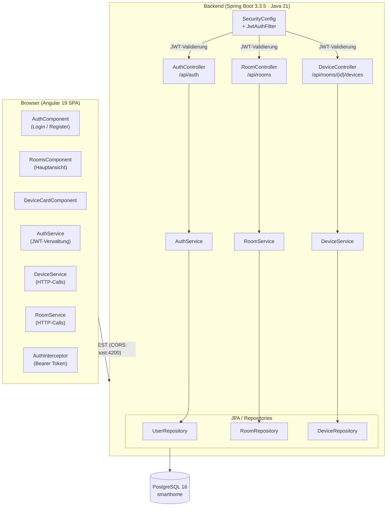
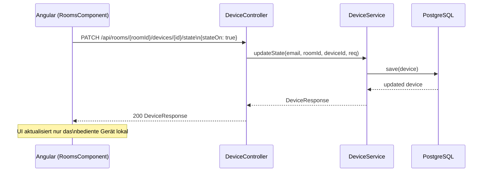

# System Architecture

## System Overview

SmartHome Orchestrator ist eine klassische Zwei-Schichten-Webanwendung:
- **Backend**: Spring Boot 3.3.5 (Java 21), REST-API, JWT-Auth, PostgreSQL via JPA/Flyway
- **Frontend**: Angular 19 SPA, Angular Material UI, RxJS, HTTP-Interceptors
- **Datenbank**: PostgreSQL 16 (Docker-managed)

## Architecture Diagram

## Component Descriptions

### AuthController
- **Purpose**: Öffentliche Endpunkte für Registrierung und Login
- **Responsibilities**: Request-Validierung, Delegation an AuthService, JWT zurückgeben
- **Dependencies**: AuthService
- **Type**: Application / Controller

### DeviceController
- **Purpose**: CRUD + State-Änderungen für Geräte (scope: pro Raum + User)
- **Responsibilities**: GET, POST, PUT, PATCH /state, DELETE auf Geräten
- **Dependencies**: DeviceService
- **Type**: Application / Controller

### RoomController
- **Purpose**: CRUD für Räume (scope: pro User)
- **Responsibilities**: GET, POST, PUT, DELETE auf Räumen
- **Dependencies**: RoomService
- **Type**: Application / Controller

### DeviceService
- **Purpose**: Geschäftslogik für Geräteverwaltung und Zustandsänderungen
- **Responsibilities**: Namensvalidierung, CRUD-Delegation, partielle State-Updates
- **Dependencies**: DeviceRepository, RoomRepository, UserRepository
- **Type**: Application / Service

### SecurityConfig + JwtAuthFilter
- **Purpose**: Stateless JWT-Authentifizierung, CORS-Konfiguration
- **Responsibilities**: Token-Validierung, SecurityContext-Population
- **Dependencies**: JwtUtil, UserRepository
- **Type**: Application / Security

## Data Flow — Gerätezustand ändern (aktuell)

## Integration Points

- **External APIs**: keine
- **Databases**: PostgreSQL 16 (lokal via Docker, JDBC)
- **Third-party Services**: keine

## Infrastructure Components

- **Docker**: postgres:16 Service (docker-compose.yml), Healthcheck via pg_isready
- **Deployment Model**: Lokale Entwicklung; CI via GitHub Actions (Ubuntu, Java 21, Node 22)
- **Networking**: localhost:8080 (Backend), localhost:4200 (Frontend)
