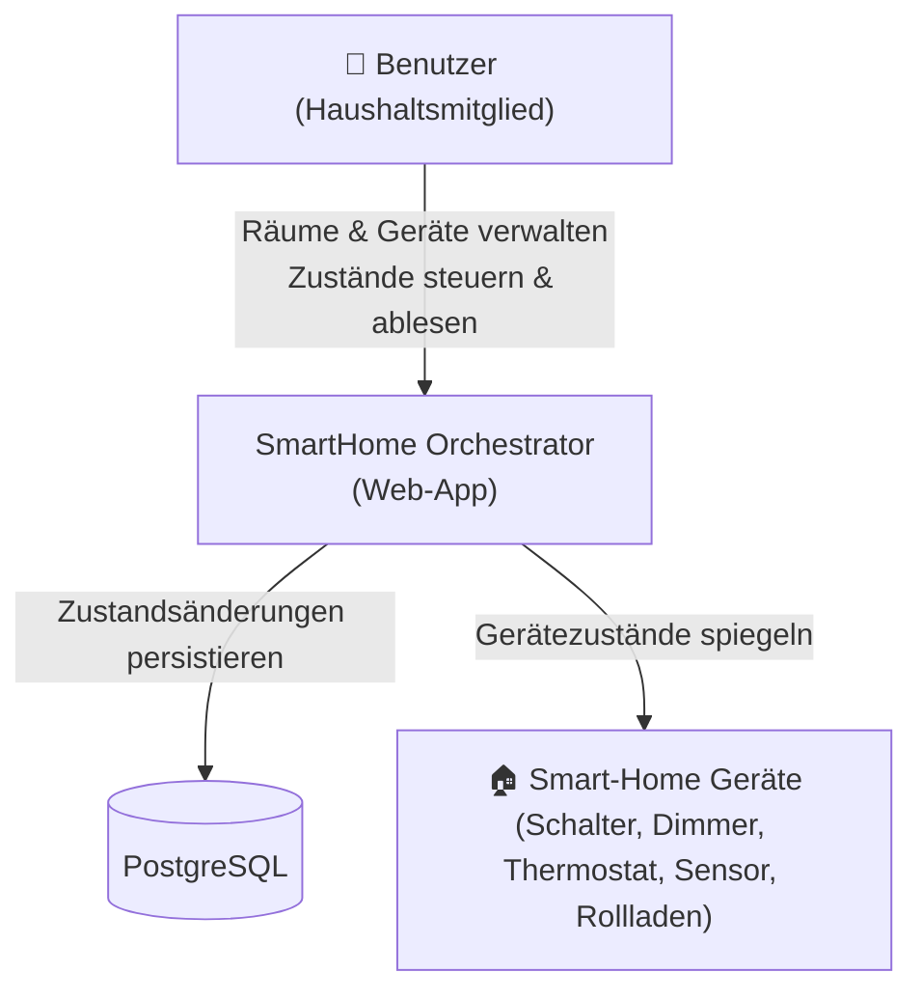

# Business Overview

## Business Context Diagram

## Business Description

- **Business Description**: Das SmartHome Orchestrator-System ermöglicht privaten Benutzern die zentrale Verwaltung und Steuerung von Smart-Home-Geräten über eine browserbasierte Oberfläche. Benutzer können Räume anlegen, Geräte in Räumen organisieren und den Betriebszustand jedes Geräts einsehen und ändern.
- **Business Transactions**:
  | Nr. | Transaktion | Beschreibung |
  |-----|-------------|--------------|
  | T-01 | Benutzer-Registrierung | Neues Konto anlegen (Name, E-Mail, Passwort) |
  | T-02 | Benutzer-Login | Authentifizierung, JWT-Token-Ausstellung |
  | T-03 | Raum anlegen / umbenennen / löschen | CRUD auf Raumobjekten |
  | T-04 | Gerät hinzufügen / umbenennen / löschen | CRUD auf Geräteobjekten innerhalb eines Raums |
  | T-05 | Gerätezustand abfragen | Lesen aller Geräte-States (on/off, brightness, temperature, …) |
  | T-06 | Gerätezustand ändern | PATCH-Aufruf zum Aktualisieren von State-Feldern |
  | T-07 | Echtzeit-Zustandsanzeige (**FR-07, geplant**) | Zustandsänderungen werden ohne manuelles Reload in der UI angezeigt |

- **Business Dictionary**:
  | Begriff | Bedeutung |
  |---------|-----------|
  | Raum | Logische Gruppierung von Geräten (z. B. Wohnzimmer, Küche) |
  | Gerät | Smart-Home-Endgerät mit Typ und Zustandsfeldern |
  | DeviceType | Enum: SWITCH, DIMMER, THERMOSTAT, SENSOR, COVER |
  | Zustand | Kombination aus stateOn, brightness, temperature, sensorValue, coverPosition |
  | JWT | JSON Web Token zur zustandslosen Authentifizierung |

## Component Level Business Descriptions

### backend/
- **Purpose**: RESTful API-Server, Geschäftslogik, Datenpersistierung
- **Responsibilities**: Authentifizierung, CRUD für Räume und Geräte, Zustandsänderungen

### frontend/
- **Purpose**: Single-Page-Application (Angular 19) für die Benutzeroberfläche
- **Responsibilities**: Login/Register, Raumübersicht, Gerätekarten mit Steuerung, Real-Time-Anzeige (geplant)
