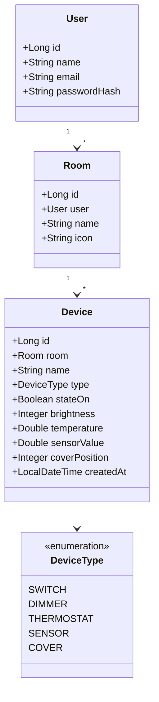

# Code Structure

## Build System
- **Backend**: Maven 3 (`pom.xml`), Spring Boot Maven Plugin, PMD Plugin 3.21.2, JaCoCo
- **Frontend**: npm / Angular CLI 19.2.7 (`package.json`, `angular.json`)

## Key Classes — Backend

## Existing Files Inventory

### Backend — Controller
- `controller/AuthController.java` — POST /api/auth/register, POST /api/auth/login
- `controller/DeviceController.java` — GET/POST/PUT/PATCH/DELETE auf /api/rooms/{roomId}/devices
- `controller/RoomController.java` — GET/POST/PUT/DELETE auf /api/rooms

### Backend — Service
- `service/AuthService.java` — register(), login(), JWT-Ausstellung
- `service/DeviceService.java` — getDevices(), addDevice(), renameDevice(), deleteDevice(), updateState()
- `service/RoomService.java` — getRooms(), createRoom(), renameRoom(), deleteRoom()

### Backend — Domain
- `domain/Device.java` — JPA Entity, alle Zustandsfelder
- `domain/Room.java` — JPA Entity
- `domain/User.java` — JPA Entity, implements UserDetails
- `domain/DeviceType.java` — Enum

### Backend — Repository
- `repository/DeviceRepository.java` — findByRoomIdOrderByCreatedAtAsc, findByIdAndRoomId, existsByRoomIdAndName, existsByRoomIdAndNameAndIdNot
- `repository/RoomRepository.java` — findByIdAndUserId, findByUserIdOrderByCreatedAtAsc, existsByUserIdAndName
- `repository/UserRepository.java` — findByEmail, existsByEmail

### Backend — DTO
- `dto/DeviceRequest.java`, `DeviceResponse.java`, `DeviceStateRequest.java`, `RenameDeviceRequest.java`
- `dto/RoomRequest.java`, `RoomResponse.java`
- `dto/AuthResponse.java`, `LoginRequest.java`, `RegisterRequest.java`

### Backend — Security
- `security/JwtUtil.java` — generateToken(), extractEmail(), isValid() (24h)
- `security/JwtAuthFilter.java` — Bearer-Token-Validierung, SecurityContextHolder
- `security/SecurityConfig.java` — CORS localhost:4200, Stateless JWT, BCrypt, öffentliche Auth-Paths

### Backend — DB Migrations
- `resources/db/migration/V1__create_users_table.sql`
- `resources/db/migration/V2__create_rooms_table.sql`
- `resources/db/migration/V3__create_devices_table.sql`
- `resources/db/migration/V4__add_device_state_columns.sql`

### Frontend — Core
- `core/models.ts` — Interfaces: Device, DeviceState, Room, Scene, Rule, Schedule; Typ DeviceType
- `core/auth.service.ts` — login(), register(), logout(), user$ BehaviorSubject
- `core/device.service.ts` — getDevices(), addDevice(), renameDevice(), removeDevice(), updateState()
- `core/room.service.ts` — getRooms(), createRoom(), renameRoom(), deleteRoom()
- `core/auth.guard.ts` — Route-Guard (canActivate)
- `core/auth.interceptor.ts` — HttpInterceptor: Bearer-Token

### Frontend — Features
- `features/rooms/rooms.component.ts` — Hauptansicht: Raumliste + Gerätekarten
- `features/rooms/add-room-dialog.component.ts` — Dialog: Raum hinzufügen
- `features/rooms/rename-room-dialog.component.ts` — Dialog: Raum umbenennen
- `features/rooms/add-device-dialog.component.ts` — Dialog: Gerät hinzufügen (DeviceType-Auswahl)
- `features/rooms/rename-device-dialog.component.ts` — Dialog: Gerät umbenennen
- `features/rooms/inject-value-dialog.component.ts` — Dialog: Sensorwert setzen
- `features/auth/login.component.ts` — Login-Formular
- `features/auth/register.component.ts` — Registrierungs-Formular

### Frontend — Shared
- `shared/components/device-card/device-card.component.ts` — Gerätekarte (Toggle, Slider, …)
- `shared/components/confirm-dialog/confirm-dialog.component.ts`
- `shared/components/empty-state/empty-state.component.ts`

## Design Patterns
### Repository Pattern
- **Location**: `repository/`
- **Purpose**: Datenzugriffs-Abstraktion via Spring Data JPA

### DTO Pattern
- **Location**: `dto/`
- **Purpose**: Trennung von Domain-Model und API-Vertrag

### Service Layer Pattern
- **Location**: `service/`
- **Purpose**: Geschäftslogik zentral und testbar

### Interceptor Pattern (Frontend)
- **Location**: `core/auth.interceptor.ts`
- **Purpose**: Automatisches Hinzufügen von JWT zu allen HTTP-Requests

## Critical Dependencies

### Backend
| Dependency | Version | Usage |
|---|---|---|
| spring-boot-starter-web | 3.3.5 | REST-API |
| spring-boot-starter-data-jpa | 3.3.5 | ORM/Repositories |
| spring-boot-starter-security | 3.3.5 | Auth |
| jjwt | 0.12.6 | JWT |
| flyway-core | via Boot | DB-Migrationen |
| postgresql | runtime | JDBC-Treiber |

### Frontend
| Dependency | Version | Usage |
|---|---|---|
| @angular/core | 19.2.0 | Framework |
| @angular/material | 19.2.19 | UI-Komponenten |
| rxjs | 7.8.0 | Reaktive Programmierung |
