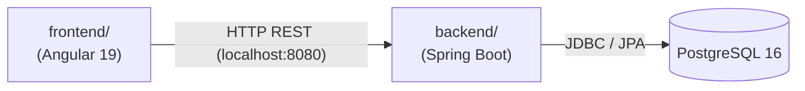

# Dependencies

## Internal Dependencies

### frontend/ hängt ab von backend/
- **Typ**: Runtime
- **Grund**: Angular ruft alle REST-Endpunkte des Spring Boot Backends auf

### backend/ hängt ab von PostgreSQL
- **Typ**: Runtime
- **Grund**: Datenpersistierung via Spring Data JPA / Flyway

## External Dependencies — Backend
| Dependency | Version | Zweck | Lizenz |
|---|---|---|---|
| spring-boot-starter-web | 3.3.5 | REST-API | Apache 2.0 |
| spring-boot-starter-data-jpa | 3.3.5 | ORM | Apache 2.0 |
| spring-boot-starter-security | 3.3.5 | Auth | Apache 2.0 |
| spring-boot-starter-validation | 3.3.5 | Bean Validation | Apache 2.0 |
| jjwt-api / impl / jackson | 0.12.6 | JWT | Apache 2.0 |
| flyway-core | via Boot | DB-Migrationen | Apache 2.0 |
| flyway-database-postgresql | via Boot | PostgreSQL-Support | Apache 2.0 |
| postgresql | runtime | JDBC-Treiber | BSD-2 |
| spring-boot-starter-test | test | Testing | Apache 2.0 |
| spring-security-test | test | Security-Testing | Apache 2.0 |

## External Dependencies — Frontend
| Dependency | Version | Zweck |
|---|---|---|
| @angular/core | 19.2.0 | Framework |
| @angular/material | 19.2.19 | UI |
| @angular/cdk | 19.2.19 | Component Dev Kit |
| @angular/forms | 19.2.0 | Formulare |
| @angular/router | 19.2.0 | Routing |
| rxjs | 7.8.0 | Reaktive Streams |
| zone.js | 0.15.0 | Angular Change Detection |
