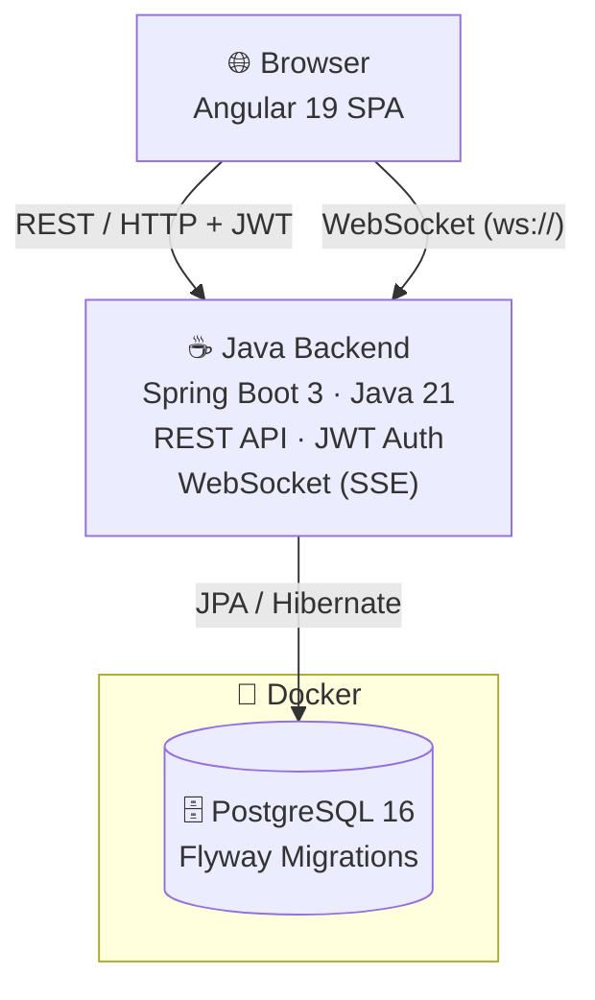

# SmartHome Orchestrator — Architecture Overview

## Beschreibung

Das System besteht aus drei Hauptkomponenten:

**Frontend** läuft als Angular 19 Single-Page-Application direkt im Browser. Es kommuniziert mit dem Backend über zwei Kanäle: REST-Calls für CRUD-Operationen (gesichert via JWT Bearer Token) und eine persistente WebSocket-Verbindung für Echtzeit-Updates (Gerätestatus, Activity Log, Rule-Benachrichtigungen).

**Backend** ist eine Spring Boot 3 Anwendung (Java 21), die lokal auf Port 8080 läuft. Es stellt die REST-API bereit, übernimmt die JWT-Authentifizierung, enthält die gesamte Business-Logik (Rule Engine, Scheduler) und verwaltet die WebSocket-Sessions.

**Datenbank** ist eine PostgreSQL 16 Instanz, die in einem Docker-Container auf Port 5432 läuft. Das Schema wird automatisch beim Start über Flyway-Migrationen (V1–V13) verwaltet. Der Zugriff vom Backend erfolgt über Spring Data JPA mit Hibernate.

---

## Key Components

| Component | Technology | Role |
|-----------|-----------|------|
| Frontend | Angular 19 | SPA — UI, real-time updates via WebSocket |
| Backend | Spring Boot 3 · Java 21 | REST API, business logic, rule engine, scheduler |
| Database | PostgreSQL 16 | Persistent storage, schema via Flyway |
| Auth | JWT (self-issued) + BCrypt | Stateless authentication |
| Container | Docker | Hostet PostgreSQL-Instanz |
