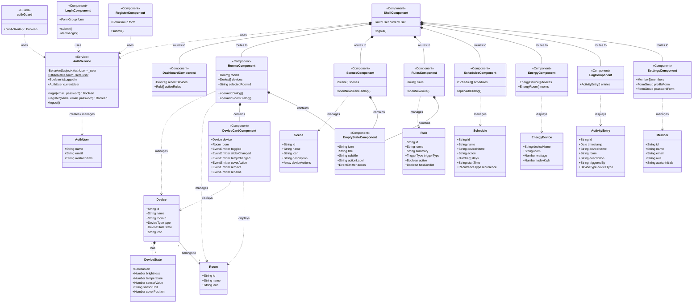

# UML Class Diagram – SmartHome Orchestrator

```mermaid
classDiagram

    %% ─── Core Models ─────────────────────────────────────────────

    class AuthUser {
        +String name
        +String email
        +String avatarInitials
    }

    class Device {
        +String id
        +String name
        +String roomId
        +DeviceType type
        +DeviceState state
        +String icon
    }

    class DeviceState {
        +Boolean on
        +Number brightness
        +Number temperature
        +Number sensorValue
        +String sensorUnit
        +Number coverPosition
    }

    class Room {
        +String id
        +String name
        +String icon
    }

    class Scene {
        +String id
        +String name
        +String icon
        +String description
        +Array deviceActions
    }

    class Rule {
        +String id
        +String name
        +String summary
        +TriggerType triggerType
        +Boolean active
        +Boolean hasConflict
    }

    class Schedule {
        +String id
        +String name
        +String deviceName
        +String action
        +Number[] days
        +String startTime
        +RecurrenceType recurrence
    }

    class Member {
        +String id
        +String name
        +String email
        +String role
        +String avatarInitials
    }

    class ActivityEntry {
        +String id
        +Date timestamp
        +String deviceName
        +String room
        +String description
        +String triggeredBy
        +DeviceType deviceType
    }

    class EnergyDevice {
        +String deviceName
        +String room
        +Number wattage
        +Number todayKwh
    }

    %% ─── Core Services & Guards ──────────────────────────────────

    class AuthService {
        <<Service>>
        -BehaviorSubject~AuthUser~ _user
        +Observable~AuthUser~ user$
        +Boolean isLoggedIn
        +AuthUser currentUser
        +login(email, password) Boolean
        +register(name, email, password) Boolean
        +logout()
    }

    class authGuard {
        <<Guard>>
        +canActivate() Boolean
    }

    %% ─── Layout ──────────────────────────────────────────────────

    class ShellComponent {
        <<Component>>
        +AuthUser currentUser
        +logout()
    }

    %% ─── Auth Pages ──────────────────────────────────────────────

    class LoginComponent {
        <<Component>>
        +FormGroup form
        +submit()
        +demoLogin()
    }

    class RegisterComponent {
        <<Component>>
        +FormGroup form
        +submit()
    }

    %% ─── Feature Pages ───────────────────────────────────────────

    class DashboardComponent {
        <<Component>>
        +Device[] recentDevices
        +Rule[] activeRules
    }

    class RoomsComponent {
        <<Component>>
        +Room[] rooms
        +Device[] devices
        +String selectedRoomId
        +openAddDialog()
        +openAddRoomDialog()
    }

    class ScenesComponent {
        <<Component>>
        +Scene[] scenes
        +openNewSceneDialog()
    }

    class RulesComponent {
        <<Component>>
        +Rule[] rules
        +openNewRule()
    }

    class SchedulesComponent {
        <<Component>>
        +Schedule[] schedules
        +openAddDialog()
    }

    class EnergyComponent {
        <<Component>>
        +EnergyDevice[] devices
        +EnergyRoom[] rooms
    }

    class LogComponent {
        <<Component>>
        +ActivityEntry[] entries
    }

    class SettingsComponent {
        <<Component>>
        +Member[] members
        +FormGroup profileForm
        +FormGroup passwordForm
    }

    %% ─── Shared Components ───────────────────────────────────────

    class DeviceCardComponent {
        <<Component>>
        +Device device
        +Room room
        +EventEmitter toggled
        +EventEmitter sliderChanged
        +EventEmitter tempChanged
        +EventEmitter coverAction
        +EventEmitter remove
        +EventEmitter rename
    }

    class EmptyStateComponent {
        <<Component>>
        +String icon
        +String title
        +String subtitle
        +String actionLabel
        +EventEmitter action
    }

    %% ─── Relationships ───────────────────────────────────────────

    %% Model compositions
    Device "1" *-- "1" DeviceState : has
    Device "n" --> "1" Room : belongs to

    %% Auth
    AuthService ..> AuthUser : creates / manages
    authGuard ..> AuthService : uses
    LoginComponent ..> AuthService : uses
    RegisterComponent ..> AuthService : uses
    ShellComponent ..> AuthService : uses

    %% Routing (ShellComponent wraps all protected pages)
    ShellComponent *-- DashboardComponent : routes to
    ShellComponent *-- RoomsComponent : routes to
    ShellComponent *-- ScenesComponent : routes to
    ShellComponent *-- RulesComponent : routes to
    ShellComponent *-- SchedulesComponent : routes to
    ShellComponent *-- EnergyComponent : routes to
    ShellComponent *-- LogComponent : routes to
    ShellComponent *-- SettingsComponent : routes to

    %% Feature ↔ Model
    RoomsComponent ..> Device : manages
    RoomsComponent ..> Room : manages
    ScenesComponent ..> Scene : manages
    RulesComponent ..> Rule : manages
    SchedulesComponent ..> Schedule : manages
    LogComponent ..> ActivityEntry : displays
    EnergyComponent ..> EnergyDevice : displays
    SettingsComponent ..> Member : manages

    %% Shared component usage
    RoomsComponent *-- DeviceCardComponent : contains
    RoomsComponent *-- EmptyStateComponent : contains
    RulesComponent *-- EmptyStateComponent : contains
    ScenesComponent *-- EmptyStateComponent : contains
    DeviceCardComponent ..> Device : displays
    DeviceCardComponent ..> Room : displays
```
